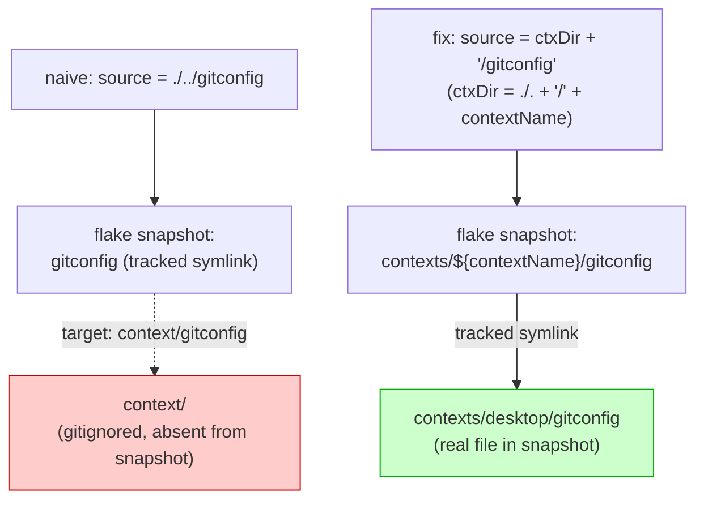

# Dotfiles Design

How this repo satisfies [use-cases.md](use-cases.md). Each **use case (UC-N)** is a user-facing goal documented there; section headings here reference them parenthetically.

Ted's shared user environment. Works on all hosts. NixOS system and Sway design: `~/nixos-config/docs/design.md`.

## Principles

1. **One environment, all hosts.** Same config on NixOS and Crostini. Platform differences handled by `contexts/`.
2. **Managed deployment.** Configs live here. Deployed read-only. Change the source, commit, run `update-env`. See [Managed config deployment](#managed-config-deployment) under Deployment.
3. **Single-file bash init.** One entry point replaces `.bashrc`, `.bash_profile`, `.profile`. Explicit mode detection, no hidden sourcing rules. See [Why a single entry point](#why-a-single-entry-point).
4. **Idempotent deployment.** `update-env` works on fresh or existing machines. Converges to desired state.
5. **Nix for packages, dotfiles for config.** `home.nix` says what to install. Dotfiles say how to configure.
6. **Nix owns declarative config. Bash owns shell-evaluated behavior.** Decision test: can this be expressed as static data or generated config without bash evaluating shell state? If yes -> nix. If no -> bash. See [Nix/bash boundary](#nixbash-boundary).

## What this repo owns

- `shared.nix` -- cross-platform packages, programs, session variables; imported everywhere
- `contexts/linux-base.nix` -- Linux+Crostini shared layer: notify-send wrapper, calendar/khal-notify, dotfile symlinks
- `contexts/<platform>/home.nix` -- platform-specific packages and overrides
- Bash -- custom app-based init system
- Git -- identity, aliases, global ignore (now home-manager-managed via `home.file`)
- Tmux, SSH, Ranger, Liquidprompt -- platform-aware via `contexts/`, deployed via home-manager
- Claude Code -- settings managed via `home.file`
- VPN access -- dual-client (gpoc Rust rewrite + proprietary pangp), `vpn-mode` toggle, `vpn-connect` auto-dispatch; plus Crostini-only browser proxy stack
- Phone notifications -- `notify-send` wrapper bridging to ntfy.sh
- Neovim -- separate `dot_vim` repo

## Structure

```
shared.nix                      # Shared packages, programs, config (imported by all contexts)
home.nix                        # Symlink to active context's home.nix
flake.nix, flake.lock           # Crostini HM configs, lockfile-pinned bash tools, multi-system dev shell (tesht, mk, kcov, wl-clipboard)
bash-tools.nix                  # Bash dev tool derivations (flake sources or fetchFromGitHub fallback)
update-env                      # Idempotent deployment script (installs nix, bootstraps shell)
mk                              # Project mk script (bump-nixpkgs, bump-task-bash)
claude/                         # Claude Code config: settings.json + CLAUDE.md (base + guides, stage 1) + CLAUDE-era.md (era, stage 2)
bash/
  init.bash                     # Entry point -> .bashrc, .bash_profile, .profile
  apps/                         # Per-app modules (env, init, cmds, deps)
  settings/                     # Base, login, interactive, env, cmds
  lib/                          # Init system internals
contexts/
  mkScriptBin.nix               # Shared helper: build wrapped script binaries with store-path substitutions
  linux-base.nix                # Linux+Crostini shared layer (imports shared.nix); calendar, notify-send wrapper, dotfile symlinks
  desktop/home.nix              # NixOS desktop (imports linux-base.nix + pangp.nix); gpoc via flake input, pangp via ./pangp.nix
  nixos -> desktop              # Platform alias (detectPlatform returns "nixos" on NixOS hosts)
  crostini/home.nix             # Crostini-specific (imports linux-base.nix + pangp.nix); gpoc via apt, pangp via ./pangp.nix; tinyproxy + PAC for UC-8
  pangp.nix                     # Home-manager module: install pangp pkg, gpa user-service, xdg-mime, optional Debian system-unit activation hook
  debian -> crostini            # Platform alias (detectPlatform returns "debian" on standalone Debian)
  macos/home.nix                # macOS-specific (imports shared.nix directly; skips the linux-base layer)
gitconfig, gitignore_global     # Git (SSH commit signing enabled on linux)
tmux.conf                       # Context-dependent symlink
ssh/config, ssh/authorized_keys  # Tracked; HM-managed client config (symlinked via linux-base.nix)
ranger/                         # File manager
liquidprompt/                   # Prompt theme
scripts/                        # Setup utilities (notify-send, vpn-connect, vpn-mode, pangp-enable-default-browser, khal-notify, lib.bash, load-sparkline)
pangp.nix                       # Derivation packaging PAN's proprietary Linux client (PanGPLinux-*.tgz -> pristine .deb extract + HOME-wrap + StateDirectory'd systemd unit; NixOS loader via programs.nix-ld)
docs/                           # use-cases.md, design.md, environment-lifecycle.md, vpn.md, uc-init.md, scaffold.md
                                # Sensitive docs (security.md, secrets-lifecycle.md, threat-model.md) stored as 1Password secure documents
```

## Component Design

### Deployment (UC-4)

`update-env` takes a bare machine to fully configured. Bootstrap entry point: `curl -fsSL https://raw.githubusercontent.com/binaryphile/dotfiles/main/update-env | bash -s -- -1 <hostname>`. Lives in `~/dotfiles/update-env`, deployed to `~/.local/bin/`.

**Injectable dependencies:** update-env uses the standard DI pattern for external commands: `curl=${curl:-curl}`, `sha256sum=${sha256sum:-sha256sum}`, `ssh=${ssh:-ssh}`, `ssh_add=${ssh_add:-ssh-add}`, `ssh_keygen=${ssh_keygen:-ssh-keygen}`. Defaults resolve to the bare command name; tests can override via bash dynamic scoping.

**Bootstrap dependencies:** update-env requires lib.bash and task.bash before any task runs. Each has its own bootstrap path:

- **lib.bash** is sourced from the local repo (`scripts/lib.bash`) when update-env runs from disk. During curl-pipe bootstrap (`curl ... | bash`), `resolveSourceDir` fails and lib.bash is fetched from GitHub branch tip with no verification -- same trust anchor as the outer curl-pipe.
- **task.bash** is sourced from the nix store via `TASK_BASH_LIB` when set (after home-manager switch). When `TASK_BASH_LIB` is unset, task.bash is fetched from a pinned GitHub commit and SHA-256 verified before sourcing. This is not limited to bare-machine first run -- it fires on any run where `TASK_BASH_LIB` is absent: after losing the nix profile, or on platforms without home-manager flake configs. The expected hash lives in `update-env` itself (same-repo trust root -- see [Security Model](#security-model) for trust analysis). After home-manager switch, `convergeTaskBash` re-sources task.bash from the nix store, replacing the bootstrap copy for the remainder of the run.

**Bumping nixpkgs:** `./mk bump-nixpkgs` updates `~/projects/era/flake.lock` to the latest nixpkgs commit. After running it, `update-env -2` propagates the new rev to all managed project flake.lock files (see step 10 below).

**Bumping task.bash:** Three pins must be updated together: flake.lock (nix store copy), `TaskBashBootstrapRev` and `TaskBashBootstrapSha256` in update-env (bootstrap copy). `./mk bump-task-bash` automates this -- updates the flake lock, reads the new rev, fetches and hashes the file, and patches update-env.

Two stages:

**Stage 1** (critical path -- working shell with identity):

1. System setup. Crostini: verifies ChromeOS shared storage is mounted, then accepts optional hostname argument (`update-env -1 <hostname>`), written to `$CrostiniDir/hostname` for machine identity. First run without hostname is fatal. Creates `$CrostiniDir` only when backing storage exists. All platforms: apt-get upgrade (crostini/debian only).
2. Clone dotfiles via HTTPS, install bootstrap symlinks (`.bash_profile`, `.bashrc`, `.profile` -> `bash/init.bash`; `~/dotfiles/context` -> active context). Remaining symlinks managed by home-manager via `linux-base.nix`.
3. Install Nix + home-manager + gpoc (crostini/debian/linux/macos -- skipped on NixOS). Nix installed via the [Determinate Nix installer](https://github.com/DeterminateSystems/nix-installer) -- a pinned release binary downloaded from GitHub, SHA-256 verified before execution. No `curl | sh`. Platform/arch auto-detected (`uname -s`/`uname -m`); supported: x86_64-linux, aarch64-linux, aarch64-darwin (x86_64-darwin dropped by Determinate in v3.13.0). On Linux, installed with `install linux --init none` (explicit planner, no systemd service); on macOS, `install` with default planner (launchd), then `/nix` ownership transferred to the current user via `chownRTask` -- effectively single-user mode, matching the old Lix pattern. After install, `writeNixConfTask` writes a declarative `/etc/nix/nix.conf` (Crostini/standalone only; NixOS manages its own). Content: `experimental-features = nix-command flakes`, `auto-optimise-store = true`, `max-jobs = auto`. Trusts only `cache.nixos.org` -- no third-party caches (see [Security Model](#security-model)). Overwrites whatever the installer left behind (Lix left `cache.lix.systems`; Determinate may add its own settings). Runs under `runas root` via task.bash -- the content is expanded from `nixConfContent` into a temp file in the current shell, then `install`ed to `/etc/nix/nix.conf` under sudo. This avoids passing shell functions across the sudo boundary (bare function names in `cmd` are not visible in the `sudo bash -c` subprocess). Path is injectable for testing. Installs gpoc `.deb` from yuezk's GitHub releases (Crostini only -- avoids the upstream flake's multi-minute Rust build). Verifies the pangp tarball is present at the expected path (`verifyPangpTarballTask`) and removes any prior apt-installed `globalprotect` deb (`aptRemoveGlobalprotectTask`, idempotent). Then uses `nix run ~/dotfiles#home-manager -- switch --flake ~/dotfiles#crostini --impure` to apply the full home-manager config via the lockfile-pinned HM CLI exposed from the dotfiles flake. The `--impure` flag is required because `pangp.nix`'s `src` is an absolute path outside the flake's git tree (proprietary tarball, too large to vendor); the tarball is content-addressed at unpack time so reproducibility holds. VPN wrappers (`vpn-connect`, `vpn-mode`) included. Core dev tools (task.bash, mk.bash, tesht) nix-packaged in `bash-tools.nix` with sources pinned as `flake = false` inputs in `flake.nix`; available after home-manager switch. Env vars `TASK_BASH_LIB` and `MK_BASH_LIB` set to nix store paths for automation scripts. No persistent `home-manager` installation -- it runs transiently via `nix run`.
4. Credential setup (Crostini only, requires hostname): `sshAgentPreflight` verifies the 1Password SSH agent is reachable -- checks the agent socket exists and that the agent responds with keys (fails with instructions to start 1Password and unlock). `deploySigningPub` copies the signing key `.pub` sidecar from the repo to `~/.ssh/id_ed25519_signing.pub` -- this is all `op-ssh-sign` needs to identify the 1Password vault key for commit signing (no private key on disk). `restoreSecrets` restores secrets from local or mount cache; if neither exists, prints instructions for manual creation (no automated 1Password retrieval for secrets). `agentTomlTask` writes `~/.config/1Password/ssh/agent.toml` to restrict the 1Password agent to the current machine's keys. `authPreflight` checks that the key is loaded in the agent, then tests SSH auth to each provider -- distinguishes "key not in agent" from "key not registered" from "unreachable." `runSigningKeyPreflight` verifies the signing `.pub` is deployed and its fingerprint appears in the 1Password agent's key list. After this step, `git push`, SSH clones, and signed commits all work. Headless/remote sessions without 1Password require SSH agent forwarding.

**Stage 2** (projects, dev tool repos):

5. Re-run home-manager with full config (VPN packages).
6. Credential setup: Ted unlocks work credential account (1Password). `authPreflight` tests SSH auth to each registry via 1Password SSH agent. No secrets restored to disk -- credentials accessed at runtime via `op-run` (UC-11).
7. Platform-specific setup (crostini only)
8. Clone and link remaining dev tools (jeeves, sofdevsim-2026, blog, tandem-protocol, era, shellcheck-convention-plugin)
9. Work projects (VPN-dependent, graceful failure via `try` + `ConnectTimeout`)
10. Pin all `flake.lock` files to the same nixpkgs revision. The canonical rev lives in `~/projects/era/flake.lock`. `flakeManagedDirs` selects candidate dirs by finding all `flake.nix` files under `~/projects` and `~/dotfiles` (excluding `.git/`, `node_modules/`, `vendor/`), then filtering to those where `git ls-files --error-unmatch flake.nix` succeeds -- the same check nix itself uses to decide if a flake is usable. For each managed dir, `flakeLocksPin` copies the canonical nixpkgs `locked` node from era's lock file directly into the target lock file via jq. Note: `nix flake lock --override-input` was evaluated but implies `--no-write-lock-file` and never writes anything; direct jq manipulation is used instead. Nix deduplicates store paths automatically when revs match. Idempotency check: extracts nixpkgs rev from each managed lock via jq, compares to canonical. After pinning, `flakeLocksPin` commits and pushes each changed flake.lock back to its remote (`git add flake.lock && git commit && git push`), so other machines see the canonical rev on their next `gitUpdate` and avoid autostash conflicts. Push is `loosely`'d — SSH failures (Codeberg, Bitbucket) are non-fatal; the next machine with working remote access propagates. Commit failures (e.g. transient 1Password signing blip) leave the change staged; `status --porcelain` detects staged-but-uncommitted changes on the next run and retries.
11. Neovim plugins, daily notes

Bare `update-env` runs both stages sequentially. `-1`/`-2` flags run individual stages. `-c`/`--credential` (Crostini only) runs only the credential section (agent preflight, signing key deployment, secrets, agent config, auth preflight, signing key preflight) without re-running system setup or package installation -- useful when stage 1 completed phases 1-3 but credentials need completion (e.g., interrupted bootstrap, 1Password not yet configured). Requires prior completion of phases 1-3 (nix, home-manager, hostname). `-h`/`--help` prints usage. Hostname positional argument accepted only with `-1` (`update-env -1 calderon`); rejected otherwise.

**Deployment terminology:**

- **Stage** -- top-level division. Stage 1 = critical path (working shell with identity). Stage 2 = projects, VPN.
- **Step** -- a numbered item within a stage (1-10 above). Referenced as "step 7" or "steps 8-10".
- **Phase** -- legacy label in `update-env` box comments (PHASE 1-7). Numbering does not map 1:1 to steps. Docs use "step" for the canonical sequence.
- **Section** -- progress marker emitted by `section <name>` calls in `update-env`; typically sub-step granularity (e.g. one `section` per repo clone within a step).

All public repo clones use HTTPS for the initial `task.GitClone` (before SSH keys exist), then migrate to SSH for both fetch and push on every run. Private repos use SSH with `try` wrappers. `task.GitUpdate` uses `git fetch` + `git rebase` (not `git pull`) with `rebase.autoStash=true` set via `GIT_CONFIG_*` env vars in `update-env main()` -- not the `--autostash` flag -- so repos with uncommitted local changes are rebased without losing work. `task.GitUpdate` skips repos that are diverged (ahead AND behind upstream); ahead-only repos (local commits, remote unchanged) are allowed through since rebase is a no-op. Detached HEAD and missing upstream also cause a skip. `stashCloneAndLinkTask` guards `GitUpdate` with `[[ -d .git ]] || return 0` so non-git directories (e.g., a repo that failed to clone because VPN was down) are silently skipped instead of erroring. The `gitUpdate` wrapper (update-env) drops any autostash-labeled stash entry left by a failed stash-pop after rebase -- this covers the case where local and upstream both modified the same file; the pulled version wins. The wrapper locates the specific `stash@{N}` ref via `grep -E ': autostash$'` rather than assuming `stash@{0}`, so user stashes above the autostash entry are not clobbered.

Idempotent. Platform detection: macos -> crostini -> nixos/$HOSTNAME -> debian -> desktop (fallback). `platform` is injectable via the standard DI pattern (lowercase function variable, defaults to `detectPlatform` via `${platform:-detectPlatform}`, overridable by `local` in tests). At startup, `main` validates that `contexts/$Platform` exists for any platform with the `hm` group -- fatal if missing, since both the context symlink and home-manager switch depend on it. `platformTaskGroups` is a pure decision function mapping platform to the set of task groups both stages should run (apt, hostname, gpoc, pangp, nix, hm, credential). All platforms with home-manager flake configs (crostini, debian, desktop, macos) get the `hm` group. `contexts/debian` is a symlink to `crostini`, matching the flake alias. Tested purely without mocking stage internals. For post-deployment maintenance, multi-machine sync, and development workflow, see [environment-lifecycle.md](environment-lifecycle.md).

**What belongs in update-env vs. home-manager:** The split is governed by one structural constraint and two categories:

*Structural constraint:* anything home-manager needs in order to run must be managed by `update-env`, because it must exist before `home-manager switch` executes. This is a hard dependency, not a preference.

| Owner | What | Count | Why |
|-------|------|-------|-----|
| `update-env` (bootstrap) | `.bash_profile`, `.bashrc`, `.profile` -> `bash/init.bash`; `context` -> active platform | 4 symlinks | Must exist before nix/HM runs. Shell init is a prerequisite for everything else. |
| `home-manager` (`bash-tools.nix`) | task.bash, mk.bash (libs) + mk, tesht (executables) | 3 derivations | Bash dev tools pinned as `flake = false` inputs in `flake.nix`. Libraries to nix store (dependency-only); executables on PATH. Env vars `TASK_BASH_LIB`, `MK_BASH_LIB` inject store paths for automation scripts. Bump with `nix flake update <name>`. NixOS path (via shared.nix fallback) uses `fetchFromGitHub` with pinned hashes until nixos-config consumes flake outputs. |
| `update-env` (external) | Dev tool and project repos (steps 7-10) cloned and linked to `~/.local/bin`; `update-env` itself; `era.service`; neovim config; SSH keys; credential files; crostini mounts; scaffold-managed .envrc + nix-wrapper (workgroup repos only) per project; personal repos commit bin/nix-wrapper to git (scaffold skips when git-tracked) | ~30 symlinks + installs | External repos, credentials, and platform mounts that live outside the dotfiles tree. HM can only manage files whose source is inside the nix evaluation -- cloned repos and secrets are not. Dev tool clones override nix executables via PATH for active development. |
| `home-manager` (`home.file`) | gitconfig, gitignore_global, tmux.conf, liquidprompt (2), ssh (2), ranger (3) | 10 symlinks (`linux-base.nix`) | Static dotfile configs consumed by programs. No bootstrap dependency. Benefit from HM's atomic generation switching and rollback. |
| `home-manager` (`home.file`) | Claude settings.json + project CLAUDE.md files | 3 copies (`claude.nix`) | `force: true` copies -- Claude Code may overwrite these, so HM restores them on switch. Stage-1-safe only; no era/evtctl/guide dependencies. |
| `update-env` (stage 1) | Base CLAUDE.md (Conventions, Secrets) | 1 copy (`claudeBaseCopyTask`) | Copied by update-env rather than HM because stage 2 appends era config, requiring a writable file. HM's store copy is read-only. |
| `update-env` (stage 2) | Claude era config (appended to CLAUDE.md) + per-project memory redirects | ~15 files | Era-dependent Claude Code config: `claudeEraConfigTask` appends `CLAUDE-era.md` (era memory instructions, code search, auto-memory prohibition) to the base CLAUDE.md. `claudeMemoryRedirectsTask` installs `era-memory-redirect.md` as `MEMORY.md` in each project's Claude state dir, directing the auto-memory system to era. Requires era to be built and running. |
| `home-manager` (`home.file`) | vpn, digi-security-watch scripts; proxy PAC; gpgui desktop entry | 2 symlinks + 1 generated + 1 symlink (`crostini/home.nix`) | Crostini-only scripts, generated config, and gpoc URL scheme handler. Panel is nix-packaged as a tmux dependency in `linux-base.nix`, not a `home.file` symlink. |
| `home-manager` (`programs.*`) | direnv, bat, firefox, khal, vdirsyncer | 5 modules | Declarative program config via HM modules -- not `home.file` but the same dependency tree. |

**Flake source snapshot semantics.** When a flake is evaluated, Nix snapshots the tracked source tree into the store. Paths excluded from the flake source (including gitignored paths in this repository) do not exist during evaluation or activation. Any `source = ...` path, or any symlink chain reachable from it, must resolve entirely within the materialized flake snapshot.

*Decision test for new files:*

1. Needed before HM runs? -> `update-env`.
2. Source lives outside `~/dotfiles`? -> `update-env`, or `home.file` with `mkOutOfStoreSymlink` to the external path.
3. Source lives inside `~/dotfiles`?
   - Stable config: direct source (`./../X` for files shared across contexts; `ctxDir + "/X"` for per-context variants).
   - Active-development artifact: `linkHome` / `mkOutOfStoreSymlink`.
   - Program with an existing HM module: prefer `programs.*`.

**`home.file` source-style policy.** Entries fall into two categories:

- **Stable configuration** (gitconfig, tmux.conf, ssh/config, liquidprompt theme, ranger rc, etc. -- the bulk of `linux-base.nix`'s `home.file` block) is declared with `source = <tracked flake path>`. Nix snapshots the file into the store at evaluation, the runtime symlink is read-only, accidental writes through `~/X` cannot mutate the working tree, and the configuration is reproducible from any clean checkout.
- **Active-development artifacts** (currently: the three Crostini scripts under `~/.local/bin/`) are declared via the `linkHome` helper, which wraps `mkOutOfStoreSymlink`. The runtime symlink points back at the live working tree, so edits propagate without a `home-manager switch` -- the policy applies where edit-propagation without rebuild is operationally valuable.

Decision rule for new entries: would you expect to iterate on this file frequently while tuning the environment? Yes -> `mkOutOfStoreSymlink` (via `linkHome`). No -> direct store-path source.

The pattern is checkable by `grep -rn 'mkOutOfStoreSymlink' contexts/` -- every match is a deliberately mutable entry.

**Context-switched files and the `ctxDir` mechanism.** Four files vary per context: `gitconfig`, `tmux.conf`, `liquidprompt/liquidpromptrc`, `ssh/config`. They cannot be sourced through the top-level `~/dotfiles/<file>` symlinks, because those chain through `~/dotfiles/context/<file>`, and the `context` selector symlink is gitignored -- absent from the flake source snapshot in the nix store, so the chain dangles inside the store and activation fails with `path '...source/context/<file>' does not exist`. The fix is to route per-context paths through a `ctxDir = ./. + "/${contextName}"` prefix in `linux-base.nix`: `source = ctxDir + "/gitconfig"` resolves to `contexts/${contextName}/gitconfig`, which is tracked and therefore included in the flake source snapshot. Symlink chains inside the tracked tree are safe; the failure mode occurs only when resolution enters a path excluded from the snapshot (such as the gitignored `context/` selector). `contextName` is supplied via `extraSpecialArgs` in `flake.nix` per `homeConfigurations.<name>` (e.g. `{ contextName = "crostini"; }`). Generalization: flake-path imports may only traverse paths present in the materialized flake snapshot. Context-selection indirections that depend on gitignored or runtime-only paths therefore cannot be used as `home.file` sources -- a tracked selector symlink would be fine; only the excluded-from-snapshot case fails.



#### Managed config deployment

Config files deployed by update-env or home-manager are read-only at the destination. The correct change path is: edit the source in `~/dotfiles`, commit, push, then run `update-env` (or `home-manager switch`) on each machine to converge. Direct edits to deployed files are overwritten on the next run.

The `home.file` blocks with `force: true` (Claude settings, gpgui desktop entry) are cases where a program may overwrite the file and HM restores it on switch. They're distinct from the stable/active-development split above -- both flavors can be `force: true`.

Files requiring runtime mutation (e.g., CLAUDE.md, which stage 2 appends to) must not be managed by HM's store-copy mechanism -- they are owned by update-env instead (see `claudeBaseCopyTask`). `claudeBaseCopyTask` uses an `ok` test that rejects symlinks (`[[ -f ]] && ! [[ -L ]]`), so if home-manager has re-created a store symlink at `~/.claude/CLAUDE.md`, the task replaces it with a writable copy.

**Post-install messages** -- `postInstallMessages` prints Crostini-specific setup (PAC URL and ChromeOS proxy instructions) inline. Platform-gated by `case $(platform) in crostini ) ... ;; esac` so other hosts don't see Crostini-specific reminders.

All project repos -- including private repos like jeeves -- are cloned by update-env. Private repos use `try` so failures are non-fatal. `*CloneAndLinkTask` functions default to `main`, with per-repo overrides: `urma`, `pepin`, and `cloud-services` (Stash repos) use `develop`; `accelerated-linux` (dal/acl) uses `master`.

On NixOS, `~/nixos-config/flake.nix` imports `home.nix` via flake input. Dotfile symlinks still deployed by `update-env`.

#### Obsidian Snippets

Shared CSS snippets from `dotfiles/obsidian/snippets/*.css` are deployed to each project vault's `.obsidian/snippets/` directory by `obsidianSnippetsTask`. Vaults covered: task.bash, fp.bash, mk.bash, tesht, jeeves, sofdevsim-2026, binaryphile.github.io, tandem-protocol, era (personal), urma/obsidian, pepin/obsidian, cloud-services/obsidian, dal/obsidian, tlilley-daily-notes.

Idempotent: ok check uses `diff -q` to skip files already matching. Install uses `cp` -- no symlinks, so each vault's Obsidian instance owns its copy. Empty source dir is a no-op: ok check returns 0, target dir not created.

`obsidianSnippetsTask` uses `lib.Glob` (not a bare `*.css` pattern) because `update-env` runs with `set -f` (noglob); bare globs would not expand. `lib.Glob` temporarily restores glob expansion with nullglob, emits newline-separated matches, and restores the previous state. Empty source dir -> no output -> for-loop body never runs.

#### Era Server Build and Deploy

The era server (`era-serve`) is a Go binary built by `eraBuildTask` via `./mk build` (runs inside `nix develop` for the Go toolchain). Ok check: `exist ~/projects/era/bin/era-serve` (the gitignored Go binary). `era` is now a tracked bash CLI script -- checking for `era` would always pass and skip the build.

After build, `task.Ln` creates `~/projects/era/bin/era-serve -> ~/.local/bin/era-serve` (same pattern as `era`, `era-hook`). The service unit (`era.service`) runs `%h/.local/bin/era-serve`.

`eraServiceCleanupTask` disables and removes the legacy `era-serve.service` unit (the transitional name used briefly during the bash-CLI/Go-server split, since superseded by `era.service` matching the source filename) -- prevents dual instances after upgrade. `eraSystemdEnableTask` ensures `era.service` is enabled. `eraRestartTask` (ok: `is-active era`) starts the service if not already running -- this covers fresh builds where the binary now exists but the service hasn't started. Note: `eraRestartTask` does not restart a running service after source changes; to pick up new code, stop the service or remove the binary and re-run `update-env -2`.

Known limitation: `eraBuildTask` only ensures the binary exists, not that it matches the current source. After pulling new era commits, rebuild with `rm ~/projects/era/bin/era-serve && update-env -2`.

### Bash Init (UC-1)

#### Why a single entry point

The conventional bash init model splits startup across `.profile`, `.bash_profile`, and `.bashrc`. Which file runs depends on an interaction of login vs non-login, interactive vs non-interactive, bash vs sh, local vs remote -- a sourcing taxonomy complex enough that even experienced engineers cannot reliably state the full rules. The result is shell behavior that is difficult to predict, debug, or control.

`init.bash` replaces all three files with a single entry point. Mode detection is explicit (`ShellIsLogin`, `ShellIsInteractive`, `Reload`) and every sourcing decision is visible in the code. No hidden file-selection rules, no "bash checks for .bash_profile first but falls back to .profile unless..." -- the user reads one file and knows exactly what runs when.

This design does not use `programs.bash` (home-manager's bash module). However, other `programs.*` modules and `home.sessionVariables`/`home.sessionPath` are used freely -- principle 3 only prohibits HM managing bash startup files.

#### Architecture

`bash/init.bash` is symlinked to `.bashrc`, `.bash_profile`, `.profile`. Supports `source ~/.bashrc reload` for live reloading.

Init flow:
1. Resolve repo root via symlink
2. Source `lib/initutil.bash` (shell detection, Alias/reveal, `SplitSpace`/`Globbing`)
3. Login or reload -> source `hm-session-vars.sh` directly (if/elif fallback for portability)
4. Source `context/init.bash` (platform-specific, if present)
5. Hooks: explicit order -- liquidprompt (interactive), direnv (interactive)
6. Source `settings/base.bash`, `settings/cmds.bash`
7. Commands: auto-discover `apps/*/cmds.bash` (interactive, order-independent)
8. Interactive -> source `settings/interactive.bash`
9. Interactive login or reload -> source `settings/login.bash`

App modules are directories under `bash/apps/<app>/` with:
- `init.bash` -- startup hook (sourced explicitly in init.bash in defined order)
- `cmds.bash` -- aliases and functions (auto-discovered, interactive only)

Current app modules:
- `direnv` -- PROMPT_COMMAND hook (appends after liquidprompt)
- `git` -- 44 shell aliases + workflow functions (europe, wolf, venice, etc.)
- `mnencode` -- randword function
- `pandoc` -- shannon (markdown reformatter) function
- `stg` -- 30+ stgit aliases + workflow functions

Liquidprompt is nix-packaged and sourced via `command -v liquidprompt` (not an app module). The `liquidprompt/` directory contains only config (`liquidpromptrc`) and theme overrides (`liquid.theme`), deployed to `~/.config/` by home-manager.

`bash/lib/initutil.bash` (~55 lines) provides: Alias/reveal wrapper, IsFile, TestAndSource, TestAndTouch, ShellIs* detection, SplitSpace/Globbing control, and function/variable cleanup tracking.

See [uc-init.md](uc-init.md) for full use case documentation of the init system.

### Nix/bash boundary

Principle 6 governs where new configuration belongs. The boundary has shifted over time as nix absorbed more responsibility.

**Nix owns** (declarative, shell-independent):
- Packages (`home.packages`, `shared.nix`)
- Program config (`programs.direnv`, `programs.bat`, `programs.firefox`, `programs.khal`, `programs.vdirsyncer`)
- Session variables and PATH (`home.sessionVariables`, `home.sessionPath`)
- File deployment (`home.file`)
- Services (`systemd.user.services`, `systemd.user.timers`)

**Bash owns** (shell-evaluated, session-dependent):
- Shell mode detection and sourcing order (`init.bash`)
- PROMPT_COMMAND hooks (liquidprompt, direnv, eternal history)
- The `Alias`/`reveal` mechanism (wraps every alias with transparency)
- Interactive aliases and workflow functions (`cmds.bash`)
- IFS/globbing safety and namespace cleanup

**When adding a new tool**, these concerns can be combined:

| Concern | Where it goes |
|---------|--------------|
| Package installation | `shared.nix` (all hosts) or context `home.nix` (platform-specific) |
| Declarative program config | `programs.<name>` if a home-manager module exists |
| Environment variable | `home.sessionVariables` |
| PATH addition | `home.sessionPath` |
| Shell startup hook (PROMPT_COMMAND, eval) | Hook in `init.bash` (target) or `bash/apps/<tool>/init.bash` (current) |
| Interactive aliases/functions | `bash/apps/<tool>/cmds.bash` |

A tool may need several of these. For example, direnv uses nix for the package (`programs.direnv`), bash for the PROMPT_COMMAND hook (`bash/apps/direnv/init.bash`), and could have aliases in a `cmds.bash` file.

### Design goals
- Predictable startup behavior from a single readable file
- Minimal order-sensitive code
- Declarative config in nix; shell-specific behavior isolated to bash
- A broken command script should not destabilize hook initialization
- Adding a new tool should require at most one decision (nix, hook, or commands) and one file

**Hooks** (order-sensitive, rare) are sourced explicitly in `init.bash` in a defined order. Currently: liquidprompt -> direnv. Order matters because direnv's PROMPT_COMMAND hook must append after liquidprompt's. Adding a hook means adding a line to `init.bash` -- explicit, visible, no discovery mechanism needed.

**Commands** (order-independent, common) are auto-discovered from `bash/apps/*/cmds.bash`. Currently: git, stg, mnencode, pandoc. Order doesn't matter -- aliases and functions are independent. Adding commands means dropping a `cmds.bash` file in a new directory.

**Session variables** are sourced directly from `hm-session-vars.sh` in `init.bash` (login only), replacing the current indirect path through the home-manager app module symlink. Both `~/.nix-profile/...` and `/etc/profiles/per-user/$USER/...` paths are checked for NixOS/standalone portability.

**Session environment** is managed entirely by nix via `home.sessionVariables` and `home.sessionPath` in `shared.nix`. These flow into the shell through `hm-session-vars.sh`, sourced directly by `init.bash` on login.

**Failure isolation:** In the target architecture, hook sourcing and command sourcing are separate passes -- a syntax error in a `cmds.bash` file does not prevent hooks from running. In both current and target architectures, `TestAndSource` silently skips missing files, and `source` failures in one module do not abort the shell. The shell starts even with broken modules; errors appear in context.

**Liquidprompt:** Now nix-packaged (`shared.nix`). `init.bash` sources it via `command -v liquidprompt` with a guard so the shell starts cleanly if the package is missing (e.g., before first `home-manager switch`). Temp, RAM, and battery indicators are disabled in `liquidpromptrc` -- the status bar (waybar/panel) monitors these instead.

### Rejected alternatives

**`programs.bash` as the primary shell-init framework.** Generates `.bash_profile`, `.profile`, and `.bashrc` -- re-implementing the three-file sourcing model that `init.bash` was designed to replace. Would require cramming the app module system into `initExtra` as opaque nix strings. Cannot support the `Alias`/reveal mechanism (`shellAliases` produces plain aliases). Other `programs.*` modules (direnv, bat, firefox, etc.) are used freely -- this rejection is specific to HM managing bash startup files. See [Why a single entry point](#why-a-single-entry-point).

**Generated `init.bash` from nix.** Would make the structure declarative but would obscure debugging -- instead of reading one bash file, you'd read a nix expression to understand what bash gets generated. Violates the core promise of UC-I0: the user reads `init.bash` and knows exactly what runs. Revisit if: the number of hook-producing integrations grows beyond a handful, ordering constraints become nontrivial, or manual hook wiring creates duplication across hosts.

**Generalized auto-discovery for hooks.** The previous `OrderByDependencies` mechanism discovered, detected, and ordered all app modules. Since only 2 modules have hooks and their order is fixed, a general-purpose ordering system was unnecessary overhead. Explicit hook ordering in `init.bash` is simpler, more visible, and more reliable than dependency resolution.

**Keeping the detection layer.** `detect.bash` and `IsApp`/`IsCmd` gated module loading on tool availability. Under declarative provisioning, runtime detection is not a design goal -- nix guarantees packages are on PATH, and the test suite validates presence at build time. Liquidprompt was the sole user of `detect.bash`; its availability guard is now inline in `init.bash`.

### Contexts (cross-cutting)

`contexts/` holds platform overrides plus a shared Linux+Crostini intermediate layer. A `context` symlink at repo root points to the active platform.

Each platform context can override `home.nix`, `gitconfig`, `tmux.conf`, and other configs. Top-level files like `gitconfig` and `home.nix` are symlinks to their context version.

The home-manager import chain:
- `contexts/macos/home.nix` -> `shared.nix`
- `contexts/desktop/home.nix` -> `linux-base.nix` -> `shared.nix`
- `contexts/crostini/home.nix` -> `linux-base.nix` -> `shared.nix`

`linux-base.nix` exists because Linux and Crostini share substantial config that doesn't apply to macOS: notify-send-bridge (depends on libnotify), calendar/khal-notify systemd units, and the dotfile symlink set. Before this layer was extracted, both `desktop/home.nix` and `crostini/home.nix` had ~80 lines of duplicated config that drifted over time.

gpoc/vpn-connect don't live in `linux-base.nix` because the gpoc source differs per platform: Crostini uses gpoc installed via apt (avoiding the multi-minute Rust build from the upstream flake), NixOS and standalone linux use the `globalprotect-openconnect` flake input (pure evaluation -- provided by `nixos-config/flake.nix` on NixOS, by `dotfiles/flake.nix` on standalone). Each platform builds a `vpn-connect` wrapper via `mkScriptBin` in its own context (`crostini/home.nix` and `desktop/home.nix` respectively). On Crostini, `gpclient` is referenced at `/usr/bin/gpclient`.

Machine-specific contexts (e.g., `calumny`) symlink most files to their platform context (e.g., `../nixos/home.nix`) and add machine-specific config. This keeps platform config shared while allowing per-machine overrides. `detectPlatform` checks for `contexts/$HOSTNAME` before falling back to the platform alias -- when two NixOS hosts diverge (e.g., GPU config, laptop vs desktop), create `contexts/<hostname>/` and the alias is bypassed automatically.

### Packages (UC-1, UC-2, UC-3)

Declared in `home.nix`. See the file for the current list. By category:

**Dev tools (UC-1):** git, neovim, tmux (overlaid with panel in `linux-base.nix`; plain on macOS), stgit, gh, claude-code, jira-cli-go, scc, shellcheck, pandoc, diff-so-fancy, silver-searcher (ag), highlight, asciinema, asciinema-agg

**System/CLI (UC-3):** bottom, htop, ncdu, jq, tree, rsync, coreutils, dig, zip, mnemonicode

**Wayland (UC-2):** wl-clipboard, cliphist, libnotify

**Apps (UC-2):** Firefox (via `programs.firefox`), Obsidian, signal-desktop

**VPN (UC-7):** gpoc (yuezk Rust rewrite), vpn-slice, vpn-connect wrapper. On Crostini, gpoc comes from apt (avoiding the Rust build); on NixOS and standalone linux, via the `globalprotect-openconnect` flake input passed through `extraSpecialArgs`. All linux platforms use `mkScriptBin` to wrap `scripts/vpn-connect`. Plus the Crostini-only browser-VPN-access stack: tinyproxy + darkhttpd (UC-8).

**Notifications (UC-9):** notify-send wrapper that bridges desktop notifications to ntfy.sh phone push. Drops in transparently as `notify-send` for any caller.

**Calendar (UC-1):** khal, vdirsyncer (linux and crostini -- systemd integration via `linux-base.nix`)

**File management (UC-3):** ranger

### Programs managed by home-manager modules

Some tools use `programs.*` instead of `home.packages` for declarative config:

- `programs.direnv` -- direnv + nix-direnv for `use flake` support. Bash integration disabled (custom hook in `bash/apps/direnv/init.bash`).
- `programs.bat` -- default style via config file, no shell alias needed.
- `programs.firefox` -- declarative search engine and extension policies.
- `programs.khal`, `programs.vdirsyncer` -- calendar sync (linux and crostini).

### Session environment managed by nix

`home.sessionVariables` and `home.sessionPath` in `shared.nix` provide EDITOR, PAGER, CFGDIR, SECRETS, XDG_CONFIG_HOME, and PATH additions. These flow into the shell via `hm-session-vars.sh`, sourced directly by `init.bash` on login (if/elif fallback for NixOS/standalone portability).

### Firefox (UC-2)

Managed via `programs.firefox` (home-manager module), not `home.packages`. This enables declarative profile and search engine configuration.

- Default search engine: DuckDuckGo (via `policies.SearchEngines.Default`)
- Extensions auto-installed via `policies.ExtensionSettings` with `force_installed`: uBlock Origin, Privacy Badger, Vimium
- All extensions enabled in private browsing (`private_browsing = true`)
- Uses policies instead of per-profile config -- policies apply to all profiles regardless of profile path, which varies per machine
- Works on both NixOS (home-manager as NixOS module) and Debian/Crostini (standalone home-manager) -- policies are baked into the wrapped Firefox package at build time

### Credential Architecture (UC-4, UC-4a-e, UC-11)

Documented in the private security-architecture doc set (`~/projects/security-docs/security.md`, `~/projects/security-docs/threat-model.md`, `~/projects/security-docs/secrets-lifecycle.md`). These docs live in a separate private git repo (bitbucket.org/accelecon/security-docs) cloned by `update-env` stage 2 with restrictive perms (700/600). The segregation is itself a security control. Repo content here reflects functional behavior; architectural detail lives in the private docs.

**v2 mechanism: 1Password Service Accounts (not Connect).** v2 uses 1Password's Service Account model — per-machine and per-project SAs with cryptographic vault scoping — rather than 1Password Connect (the daemon-based credential broker). Rationale:

- The local-compromise threat model already accepts "same-user attacker reads any disk secret." Connect's main advantage (no plaintext disk secret) doesn't address an unmitigated threat in this model.
- Connect requires running a daemon process per machine, which adds a new attack surface (process to compromise, port to attack) and conflicts with the dotfiles philosophy of stateless local config.
- SA's distributed-bearer-token model fits the existing op-run launcher shape (resolve credential at launch, exec the tool); Connect would require a different integration pattern.

The cryptographic scoping that Service Accounts provide bounds *which vaults a token can decrypt*, not *who can use the token*. Theft resistance comes from local controls (bwrap mount policy in Hardened mode, filesystem permissions and storage hardening in Default mode), not from the cryptographic property. See `~/projects/security-docs/threat-model.md` for the full Property A vs Property B analysis.

**op-run nix packaging:** `op-run` is built via `mkScriptBin` in `linux-base.nix`. `pkgs._1password-cli` is intentionally absent from its `runtimeInputs` — the NixOS system wrapper for `op` must be used instead of the nix store binary. See the comment in `linux-base.nix` for the security rationale; the system wrapper is managed by nixos-config.

### VPN (UC-7, UC-7a)

Two GlobalProtect clients coexist on every Linux platform; UC-7a's `vpn-mode` toggle picks which one is active at any time. The dual-client setup landed 2026-05-19 in response to PAN's CVE-2026-0257 Prisma Access cookie-mint hardening, which broke yuezk's gpoc against the Digi portal indefinitely (tracked at [yuezk/GlobalProtect-openconnect#606](https://github.com/yuezk/GlobalProtect-openconnect/issues/606)). pangp is the working workaround; gpoc remains installed for when upstream lands the fix.

#### Active-client toggle (UC-7a)

State is implicit in `gpd.service`'s systemd state -- no separate state file:
- `systemctl is-active gpd.service` returns `active` => pangp mode (PAN's daemon owns the tun device, listens on IPC for connect requests)
- returns inactive => gpoc mode (gpoc launches on-demand via `vpn-connect`; no persistent service)

`scripts/vpn-mode` does the flip: `vpn-mode pangp` starts gpd+gpa services, `vpn-mode gpoc` stops them and kills any in-flight `gpclient connect` process before returning. Bare `vpn-mode` prints the current state. The flip is atomic from the user's perspective: stop succeeds before start runs, so we never have two daemons fighting over the tun device.

#### vpn-connect dispatch (UC-7 entry point)

`scripts/vpn-connect` reads `vpn-mode` and runs the right client. pangp branch: `exec globalprotect connect --portal access.digi.com` (PAN's daemon handles tunnel persistence via its own `Restart=on-failure`). gpoc branch: the existing `gpauth | gpclient connect` pipeline with retry-on-disconnect loop. Widgets (`panel`, `probe-lib`) detect `gpd0` (pangp's interface) and `tun0` (gpoc's) independently -- the dispatch is invisible at the widget layer.

#### gpoc packaging

yuezk's Rust rewrite of `globalprotect-openconnect`. nixpkgs ships only an old C++/Qt 1.4.9 build that drags in qtwebengine. gpoc is sourced differently per platform:
- **Crostini:** installed via apt by `update-env` stage 1 (`aptInstallGpocTask` downloads the `.deb` from yuezk's GitHub releases and installs with `dpkg`). The upstream flake's Rust compilation takes several minutes and has no binary cache. `crostini/home.nix` references `/usr/bin/gpclient` directly.
- **NixOS:** flake input `globalprotect-openconnect` in `nixos-config/flake.nix`, passed to home-manager via `extraSpecialArgs` as `gpoc` (pure evaluation).
- **Standalone linux:** same flake input `globalprotect-openconnect` in `dotfiles/flake.nix`, passed via `extraSpecialArgs` as `gpoc`.

Components used in the gpoc dispatch branch:
- `gpauth` -- performs SAML auth via the user's default browser, captures the cookie.
- `gpclient connect` -- drives openconnect (linked in via FFI) to bring up the GP tunnel.
- `vpn-slice` -- passed as `--script` to gpclient/openconnect for split-tunnel routing and split-horizon DNS.

#### pangp packaging

Proprietary PAN Linux client (`globalprotect`, `PanGPS`, `PanGPA`, plus bundled `libwa*` libraries). No nixpkgs derivation exists. We package it ourselves from PAN's `PanGPLinux-<ver>.tgz` (downloaded once from PAN's customer support portal; the tarball contains arch-specific .debs).

Derivation at `pangp.nix`:
- `dpkg-deb -x` unpacks the amd64 `.deb` into the build dir.
- **No `autoPatchelfHook`** (and `dontPatchELF = true`). The pangp binaries stay bit-for-bit identical to the .deb-shipped versions because PanGPS performs an asymmetric SHA-384 integrity check on PanGPA at every IPC connection (see "PanGPS App Integrity check" below). Any modification — including autoPatchelfHook's ELF-interpreter rewrite — invalidates PanGPA's signature in `/opt/.../sign/PanGPA-sha384.sig` (signed by PAN's `gp-public.pem`) and causes PanGPS to close the socket with `Error(1322)`. The pristine `$out/opt/...` subtree is the **single source of truth** for deployment: `update-env`'s `extractGlobalprotectDebToOptTask` reads `home.file` markers (`~/.local/share/pangp/{source,dest}`, deployed by `contexts/pangp.nix`) and copies the pristine bytes from nix-store into the runtime base. Both PanGPS and PanGPA land co-located there.
- On NixOS, `programs.nix-ld.enable = true` (set in `nixos-config/common/configuration.nix`) installs a real `/lib64/ld-linux-x86-64.so.2` that delegates to nix-store glibc, letting pristine generic-Linux binaries run unmodified. Crostini's native FHS already provides a real `/lib64/ld-linux-x86-64.so.2`; no nix-ld needed there. **nix-ld solves the dynamic-loader layer only**; pangp's runtime depends on several other FHS-shaped surfaces that NixOS doesn't ship by default (hardcoded `/sbin/ip`, `/sbin/route`, `/sbin/ifconfig`, `/usr/bin/openssl`, `/bin/ps`, `/usr/sbin/dmidecode` inside the PanGPS binary; stripped systemd-user env for `gpa.service` requiring `Environment=` entries for PATH/WAYLAND_DISPLAY/DBUS_SESSION_BUS_ADDRESS/XDG_RUNTIME_DIR; pangp tasks not wired into `update-env`'s NixOS platform group). The full enumeration with manual workarounds + declarative-fix shape lives in `docs/vpn.md` "NixOS deployment gaps." Declarative resolution tracked at tasks.dotfiles #6547.
- `makeWrapper` wraps the user-facing binaries (`globalprotect`, `PanGPA`) with `export HOME="${HOME:?}/.local/share/globalprotect"; mkdir -p "$HOME"` so pangp's `getenv("HOME") + "/GP_HTML/saml.html"` writes land in a hidden subdirectory rather than polluting top-level `$HOME`. The wrapper is a shell script that sets env then `exec`s the pristine underlying binary; the binary itself is unmodified.
- Systemd unit `gpd.service` is recomposed with `WorkingDirectory=/var/lib/globalprotect` + `StateDirectory=globalprotect` + an `ExecStartPre` that symlink-stages read-only files from `$out/opt/.../` into the StateDirectory. PanGPS expects to write state files (HipPolicy.dat, HIP_*_Report.dat, PanGpMPR.dat, pangps.xml, *.log) to its cwd; the nix store is read-only, so the cwd has to be elsewhere and the staged symlinks let PanGPS still find its static config.

PanGPS App Integrity check (the load-bearing constraint):
- PanGPS performs **asymmetric** integrity verification on PanGPA at every IPC connection. It reads `/proc/<peer-pid>/exe`, computes SHA-384 over the file content, and verifies the RSA signature in `/opt/.../sign/PanGPA-sha384.sig` against `/opt/.../sign/gp-public.pem`. Mismatch → close socket with `Error(1322): App Integrity: Failed to verify PanGPA Signature`. PanGPS does NOT verify its own integrity — observed 2026-05-27: a running PanGPS with autoPatchelf-rewritten interpreter ran for 9+ hours without self-rejecting, while consistently rejecting every PanGPA peer (also autoPatchelf'd) on sig grounds.
- PanGPS also performs a co-location check: `dirname(realpath(/proc/<peer-pid>/exe))` must equal `dirname(realpath(/proc/self/exe))`. Mismatch → `Error( 312): Connected by process not from GP folder`. **However**, Error 312 is also emitted as a fallback secondary log message whenever the integrity path sets `IsConnectedByPanGPA = false`, even when the folder check itself passes. Observed pattern: a single rejection produces 4 `Error(1322)` lines followed by 4 `Error( 312)` lines (different file paths probed during verification), then `Error( 212): Connected by non-PanGPA. Close socket.` So Error 312's "not from GP folder" text is misleading when sig verification has already failed — it's a downstream symptom, not the cause.
- The earlier byte-flip experiment (2026-05-20) tested PanGPS-flipping only and concluded "hashes don't matter." PanGPA-flipping wasn't tested; that's the case that fails the integrity gate. Re-verified empirically (2026-05-27): pristine `.deb`-extracted PanGPA at SHA-384 `5bbe7d19…` passes `openssl dgst -sha384 -verify` against `gp-public.pem` + `PanGPA-sha384.sig` with `Verified OK`; autoPatchelf'd PanGPA at SHA-384 `732c6dbb…` fails the same check with `bad signature`.
- **Working configuration**: deploy pristine `.deb` bytes for both binaries into `/opt/paloaltonetworks/globalprotect/`. `pangp.nix` skips autoPatchelfHook to preserve the bytes; `programs.nix-ld` provides the loader on NixOS so pristine binaries run unmodified. Crostini gets the same pristine bytes via `update-env`'s extract and uses its native FHS loader. Co-location preserved by construction (both binaries at runtime base). `pangp.nix`'s pristine `$out` is the single source of truth, with `update-env` staging it into the runtime path on both platforms.

Home-manager module at `contexts/pangp.nix`:
- `home.packages = [ pangp ]` puts the wrapped binaries on `$HOME/.nix-profile/bin/`.
- `home.file.".local/share/pangp/source"` deploys a marker file containing pangp's autoPatchelf'd source path (`${pangp.outPath}${pangp.passthru.runtimeBase}`); `home.file.".local/share/pangp/dest"` deploys a marker for the canonical runtime base. `update-env`'s `extractGlobalprotectDebToOptTask` reads these to stage binaries from nix-store to the runtime base (cross-platform: both Crostini and NixOS).
- `systemd.user.services.gpa` declares the user-side agent unit.
- `xdg.mimeApps.defaultApplications` pins `x-scheme-handler/globalprotectcallback` to `gp.desktop` (`lib.mkForce` to override the `linux-base.nix` default that points to gpoc's `gpgui.desktop`).
- `home.activation.pangpSystemUnit` (opt-in via `services.pangp.enableSystemDaemonOnDebian`, set true in `crostini/home.nix`, false in `desktop/home.nix`) `cp`s the derivation's `gpd.service` to `/etc/systemd/system/` on each `home-manager switch`, then `daemon-reload`s and restarts. Required because home-manager can't directly manage system services on non-NixOS hosts; uses `/usr/bin/sudo` absolute path because home-manager's activation env has minimal PATH.
- On NixOS the activation flag is false; the system-level `configuration.nix` uses `systemd.packages = [ pkgs.pangp ]` to install the unit (overlay-resolved from the flake).

flake.nix wiring: `pangp = import ./pangp.nix { pkgs = linuxPkgs; src = /home/ted/crostini/PanGPLinux-6.3.3-c31.tgz; }`. The src is per-machine (proprietary tarball, doesn't belong in the git tree). Because the path is absolute and outside the flake's git tree, `homeManagerFlakeSwitchTask` runs `nix run ~/dotfiles#home-manager -- switch --flake ~/dotfiles#<config> --impure` -- pure-eval mode would refuse the path access; `--impure` permits it. Content addressing at unpack time keeps reproducibility intact.

update-env wiring: `pangp` group runs on `crostini` and `desktop` platforms (per `platformTaskGroups`). Three tasks: `verifyPangpTarballTask` precondition-checks the tarball is at the expected path (fail-loud with placement instructions if missing); `aptRemoveGlobalprotectTask` removes the deprecated apt-installed `globalprotect` deb if present, idempotent (no-op when already absent); `extractGlobalprotectDebToOptTask` reads the `home.file` markers (`~/.local/share/pangp/{source,dest}`) and copies pangp's autoPatchelf'd binaries from nix-store to the runtime base. The first two are wired into stage 1 before the nix group so preconditions are asserted before home-manager runs; the extract task lives in stage 2 (after home-manager has deployed the markers).

#### vpn-connect derivation

`scripts/vpn-connect` is built via `mkScriptBin` on both platforms (`contexts/desktop/home.nix` and `contexts/crostini/home.nix`). The derivation substitutes `@vpn-slice@` and `@gpclient@` with absolute store paths because those binaries are invoked under `sudo` in the gpoc branch (`sudo` strips PATH). The pangp branch calls `globalprotect` which is on `$HOME/.nix-profile/bin/` (no substitution needed -- not invoked under sudo).

#### SAML callback flow

The callback path is non-obvious and the source of past failures. Two distinct flows exist depending on which client is active. Full step-by-step description lives in [docs/vpn.md](vpn.md). Summary:

**gpoc (HTTP-Redirect GET binding):**
1. `gpauth` opens a one-shot HTTP server to serve the SAML form HTML
2. `gpauth` opens a separate raw TCP listener on another port and writes that port to `/tmp/gpcallback.port`
3. Browser does SAML, the IdP returns a `globalprotectcallback://<base64>` URL
4. The OS dispatches that URL scheme to `gpclient launch-gui %u` via the registered `gpgui.desktop` handler
5. `gpclient launch-gui` reads the port file, opens a TCP socket to localhost, writes the auth data
6. `gpauth` accepts, reads the cookie, prints to stdout (piped to `gpclient connect --cookie-on-stdin`)

**pangp (HTTP-POST binding):**
1. PanGPS asks PanGPA to launch the default browser for SAML (`<default-browser>yes</default-browser>` in `pangps.xml`)
2. PanGPA's `CPanDefaultBrowserLinux` writes the SAML form as a local file to `~/.local/share/globalprotect/GP_HTML/saml.html` (the form auto-submits a POST to the IdP via inline `<script>`)
3. PanGPA invokes `xdg-open <saml.html>`
4. xdg-mime resolves `text/html` to `saml-host-browser.desktop` (the Crostini shim — see below)
5. The shim constructs `http://127.0.0.1:8120/saml-bundle/saml.html` and exec's `garcon-url-handler`
6. host Chrome receives the URL, fetches via the existing darkhttpd, the form's auto-submit POSTs to the IdP
7. IdP returns a redirect to `globalprotectcallback://<base64>`
8. ChromeOS dispatches the scheme back into the container via `gp.desktop`
9. gp.desktop's Exec runs `globalprotect defaultbrowser <url>`; the CLI delivers the cookie to PanGPA, which forwards to PanGPS
10. PanGPS completes gateway login; tunnel up on `gpd0`

The URL scheme handlers (`gpgui.desktop`, `gp.desktop`) are registered via home-manager's `xdg.desktopEntries` plus `xdg.mimeApps`, both in `contexts/crostini/home.nix` and `contexts/pangp.nix`.

#### Crostini garcon discovery gotcha

home-manager's `xdg.desktopEntries` installs to `~/.nix-profile/share/applications/`. **Garcon (the ChromeOS<->container bridge) only scans `~/.local/share/applications/`** for desktop files when propagating MIME registrations to the host, not arbitrary `XDG_DATA_DIRS` entries. Without an extra symlink into the standard XDG dir, host ChromeOS Chrome never learns about the `globalprotectcallback://` handler, the SAML callback URL is silently dropped, and `gpauth` hangs forever on `accept()`.

The fix: a `home.file.".local/share/applications/<name>.desktop".source` symlink (via `mkOutOfStoreSymlink`) into `~/.nix-profile/share/applications/<name>.desktop`, defined in `crostini/home.nix`. Applied to `gpgui.desktop` (gpoc) and `gp.desktop` (pangp). The mode is selected by which `.desktop` is the active default for `x-scheme-handler/globalprotectcallback` (pinned via `xdg.mimeApps.defaultApplications`).

There is a second discovery layer that's important on Crostini specifically: **ChromeOS host Chrome dispatches `globalprotectcallback://` based on the SYSTEM `/usr/share/applications/` mimeinfo cache, not the user-level `~/.local/share/applications/` cache.** The apt-installed gpoc package ships `/usr/share/applications/gpgui.desktop` claiming the scheme; in pangp mode this routes every callback to gpoc's `gpclient launch-gui` (with `Failed to feed auth data to the CLI` in `/tmp/gpcallback.log` since gpoc isn't running), and the cookie never reaches PanGPS. The pangp-mode fix is to disable the system gpgui.desktop and install gp.desktop at the system level (`update-env`'s `installPangpSystemDesktopTask`).

#### SAML host-browser shim (Crostini, pangp mode)

pangp expects the default browser to handle a local `saml.html` file (HTTP-POST binding: the SAMLRequest is a large base64 blob embedded as a hidden form field, too long for URL-query). On Crostini, host Chrome cannot read container files — `garcon_host_browser.desktop` registers only URL schemes (`http`, `https`, `ftp`, `mailto`), no file mime types. xdg-open's default text/html chain falls through to `garcon --client --terminal -e vim <file>` when no graphical container browser is on PATH (no firefox-esr by policy; nix firefox not on gpa.service's minimal PATH).

`scripts/saml-host-browser` is a one-line shim that converts the file path to an HTTP URL served by the existing `proxy-pac-server.service` darkhttpd, and hands the URL to `garcon-url-handler`:

```bash
exec /usr/bin/garcon-url-handler "http://127.0.0.1:8120/saml-bundle/$(basename "$1")"
```

The `saml-bundle` path on the darkhttpd serve root resolves via a `home.file` symlink:
```
~/.local/share/proxy-pac/saml-bundle -> ~/.local/share/globalprotect/GP_HTML
```

The `.desktop` entry (`saml-host-browser.desktop`) is pinned as the `text/html` and `application/xhtml+xml` default in `xdg.mimeApps.defaultApplications`. PanGPA's wrapped HOME would otherwise hide `~/.config/mimeapps.list` from xdg-open's lookup; `contexts/pangp.nix`'s `systemd.user.services.gpa` override explicitly sets `XDG_CONFIG_HOME=%h/.config` and `XDG_DATA_HOME=%h/.local/share` to re-point the resolution at the real `$HOME` directories.

#### Split-tunnel routing

vpn-slice receives two categories of routing arguments:

1. **CIDR ranges** (`10.0.0.0/8`, `172.26.0.0/16`) -- route all corporate internal and VPN infrastructure traffic through the tunnel. Eliminates per-host discovery for routing.
2. **Positional hostnames** -- vpn-slice resolves these via the VPN's DNS server and writes `/etc/hosts` entries, providing split-horizon DNS. Two subcategories:
   - **Split-horizon hosts** (`stash.digi.com`, `nexus.digi.com`) -- internal `*.digi.com` services where public DNS returns a different IP (e.g., stash -> Atlassian `198.51.192.159`) or NXDOMAIN. The `/etc/hosts` entry overrides the system resolver to use the internal IP. Routing is already handled by the `10.0.0.0/8` CIDR.
   - **AWS-hosted services** (`dm1.devdevicecloud.com`, `gitlab.drm.ninja`, `3.16.193.243`) -- resolve identically from public and VPN DNS, but traffic must traverse the tunnel so the server sees the VPN source IP. vpn-slice adds both routes and `/etc/hosts` entries.

`remotemanager.digi.com` is a public Digi site accessed externally -- it is intentionally excluded from the tunnel.

Note: `--domains-vpn-dns` was evaluated but does not write `/etc/hosts` entries, only affecting vpn-slice's own internal DNS queries. Positional hostnames remain necessary for split-horizon DNS.

The PAC file in `contexts/crostini/home.nix` uses `dnsDomainIs(host, ".digi.com")` to auto-match internal `*.digi.com` hosts (with early `DIRECT` exclusions for public digi sites like `remotemanager.digi.com`), plus an explicit list of the AWS-hosted services. New `*.digi.com` hosts auto-proxy via the PAC but still need adding as positional hostnames in vpn-connect for the `/etc/hosts` entry.

Notes:
- `--gateway "US East"` pre-selects the gateway, avoids interactive prompt
- `--browser xdg-open` so the browser choice respects ChromeOS's Sommelier routing on Crostini and `xdg-mime` defaults elsewhere
- yuezk's flake is unpinned; v2.4.4 tag fails to build, main works. Pin to a specific commit when upstream stabilizes

### Browser VPN access (UC-8)

ChromeOS host Chrome lives outside the Crostini container and cannot reach `tun0` directly. To let Ted click VPN-only URLs from host Chrome (instead of falling back to terminal tools or in-container Firefox), `contexts/crostini/home.nix` declares two systemd user services and a PAC file:

- **`tinyproxy`** (forward HTTP proxy) listens on the container's `127.0.0.1:8118`. Garcon's container->host localhost forwarding makes that port reachable from ChromeOS Chrome. tinyproxy itself has no special VPN knowledge -- it just forwards requests, which traverse the container's tun0 because that's the container's network namespace.
- **`darkhttpd`** (single-binary static file server) serves a PAC file from `~/.local/share/proxy-pac/proxy.pac` on `127.0.0.1:8120`. Used as a "PAC URL" host so Chrome can fetch the script.
- **`proxy.pac`** is generated by `pkgs.writeText` inside `contexts/crostini/home.nix`. Public digi sites (`remotemanager.digi.com`, `www.digi.com`, `digi.com`) are excluded early as `DIRECT`. Remaining `*.digi.com` hosts are proxied (auto-matching any new internal service), plus an explicit list of AWS-hosted VPN services. Everything else returns `DIRECT`.

Ted manually points ChromeOS Network -> Proxy -> Automatic configuration at `http://127.0.0.1:8120/proxy.pac`. After that, Chrome consults the PAC per-request:
- Non-VPN URL -> `DIRECT` -> Chrome connects without involving the container, no overhead
- VPN URL -> `PROXY 127.0.0.1:8118` -> Chrome sends to tinyproxy -> tinyproxy forwards via tun0

This is **crostini-specific** because no other host needs it: regular Linux/NixOS desktops route VPN traffic locally and reach VPN hosts directly. Lives in `contexts/crostini/home.nix` (not `linux-base.nix`) so other Linux machines don't pick up the config.

The PAC file uses `dnsDomainIs` for `*.digi.com` (auto-matching new internal services), with early `DIRECT` returns for public digi sites (`remotemanager.digi.com`, `www.digi.com`, `digi.com`), plus an explicit list for AWS-hosted services. Adding a new internal `*.digi.com` service requires adding it as a positional hostname in vpn-connect (for `/etc/hosts`) but needs no PAC change; adding a new external VPN-routed host requires updating both the vpn-slice positional args and the PAC's `vpnHosts` array; adding a new public `*.digi.com` site requires adding it to the PAC's exclusion list.

### Phone notification bridge (UC-9)

`scripts/notify-send` is a wrapper script that:
1. Forwards all arguments to the real libnotify `notify-send` (synchronously) for the local desktop popup
2. Parses `--urgency`, the trailing positional summary, and the optional body
3. If `~/secrets/ntfy-topic` exists and is readable, POSTs the notification to `https://ntfy.sh/<topic>` in a backgrounded subshell with `disown` so the calling tool doesn't block on the network

The wrapper is built via `mkScriptBin` in `linux-base.nix`. The `@notify-send@` placeholder is substituted at build time with the absolute store path to libnotify's `notify-send`, so the wrapper does not recurse into itself when invoked through PATH. `curl` and `coreutils` are added to the wrapper's runtime PATH.

Critical-urgency notifications get `Priority: high` on ntfy (loud notification on the phone); others get `Priority: default`. All messages get `Tags: bell` for the icon.

Tools that already call `notify-send` get phone push for free with no source changes -- `khal-notify` is the current consumer; future tools just call `notify-send` and inherit the bridge.

The wrapper shadows libnotify's `notify-send` because it's installed via a derivation named `notify-send` whose `bin/notify-send` ends up in the user's nix profile alongside libnotify's. Nix profile coalescing prefers the wrapper because it's installed via `home.packages` in `linux-base.nix` while libnotify is only present as a transitive dep of the wrapper itself (not directly in `home.packages`).

### Status widgets (UC-10)

Headless sessions (Crostini, SSH into NixOS without a desktop) don't have waybar, so the tmux status bar substitutes for it. Implementation lives in four files:

- **`scripts/probe-lib.bash`** -- shared probe library, sourced by both this repo's panel script AND nixos-config's waybar widget renderer. Caller sets `$State` to its own cache directory before sourcing. The same code path runs on both platforms -- drift in probe semantics is impossible at this layer. Defines:
  - Probe functions: `isStale`, `refresh`, `readState`, `pingHost`, `sshHost`, `combine`, `vpnUp`, `bitbucketApiProbe`, `codebergApiProbe`, `digiApiProbe`, `probeReachability`, `probePing`.
  - Widget metadata tables: `WidgetHost`, `WidgetVpnGated`, `WidgetApiFn`, `WidgetNoSsh` -- single source of truth for host names, VPN gating, API probe selection, and SSH probe skipping. Accessors `widgetHost`, `widgetVpnGated`, `probeWidget` let callers look up by widget key instead of repeating host strings. `WidgetNoSsh` marks hosts (dm1, nexus, remotemanager) that skip SSH probes -- `probeReachability` checks this table and skips `sshHost` for those entries, and `combine` treats `ssh=skip` + `ping=ok` as "on".
  - Injectable command globals: `timeout`, `ssh`, `curl`, `jq`, `ip`, `grep` -- each defaults to the real binary (`${var:-binary}`) but can be overridden before sourcing or via bash dynamic scope in tests, OR by callers running in minimal-PATH contexts (e.g., waybar's user-systemd exec, where `grep` isn't reachable and the bare-name resolution would fail). The lowercase naming convention follows the standard DI pattern adopted in `update-env`. Existing callers that don't set these vars get the bare-name resolution as before — additions are non-breaking.

- **`scripts/panel`** -- tmux status bar renderer. Sources `probe-lib.bash`, sets `$State=$XDG_RUNTIME_DIR/panel`, and exposes `panel <module>` (returns a tmux-formatted segment with `#[fg=...]` color codes), `panel click <module>` (mouse handler), `panel poll` (synchronous warmup), and `panel layout` (dynamic status bar height). Health monitor widgets use `segment` (hidden when on) and service toggles use `alwaysSegment` (always visible). Supporting functions: `cachedHealthState`/`cachedPingState` (read cached state without new probes -- used by `healthSep` and `layoutCmd`), `healthSep` (dynamic separator, visible only when health widgets are), `hostnameCmd` (`~/crostini/hostname` on Crostini, system hostname elsewhere), `canLoadCmd` (checks `tmux show-env` for SSH without desktop). Packaged as a nix-wrapped tmux dependency in `linux-base.nix`: a thin wrapper script execs the live `~/dotfiles/scripts/panel` with runtime dependencies (curl, jq, openssh, iproute2, procps, coreutils, gawk, systemd) on PATH. The tmux package is overlaid via `symlinkJoin` + `makeWrapper` to include panel on its PATH, so `#(panel ...)` status bar commands work regardless of the session environment. Panel is a store copy (not a live symlink); edits require `home-manager switch`. The overlay lives in `linux-base.nix`; `shared.nix` no longer includes tmux (macOS adds plain tmux in its context; panel overlay to be added when there's a macOS use case for the tmux status bar). Runtime dep completeness is validated by `test_panelHermetic`, which runs the packaged panel binary under a stripped PATH (only the panel wrapper's own PATH) and verifies key subcommands exit without "command not found" errors.

- **`contexts/panel.tmux.conf`** -- shared panel config sourced via `session-created` hook (never during initial config parse -- session-scoped `set` silently fails before session creation). Options use `set` without `-g` so sessions independently have panel or not. `bind-key` is the exception (inherently global); guarded by `show-option` on `@panel-right`. Two sourcing paths: Crostini replaces Linux's conditional hook with unconditional; Linux's hook runs `panel can-load` (checks `tmux show-env` for `SSH_CONNECTION` set and `WAYLAND_DISPLAY` absent). Limitation: `tmux attach` doesn't re-evaluate. For full isolation: `tmux -L ssh new`.

- **`contexts/crostini/tmux.conf`** -- sources linux/tmux.conf for the base, then replaces Linux's conditional `session-created` hook with an unconditional one (Crostini is always headless).

**Probe cadences** (set in `probe-lib.bash`):
- SSH probe (`sshHost`): every 600s. `ssh -T git@<host>`; rc 0/1 or "shell request failed" both count as ok.
- TCP/443 ping (`pingHost`): every 30s. Uses `bash`'s `/dev/tcp/<host>/443` rather than ICMP because most vendor sites block ICMP.
- Vendor status API (`bitbucketApiProbe`, `codebergApiProbe`, `digiApiProbe`): every 30s. Atlassian Statuspage component `qmh4tj8h5kbn` (bitbucket), Codeberg Uptime Kuma monitor 1 ("Codeberg.org" — the main site), and Digi Remote Manager status page (worst-of across all components) respectively. `digiApiProbe` is shared by dm1 and remotemanager widgets. The earlier "Codeberg SSH access" monitor (id 7) was retired from Codeberg's public status page; main-site (id 1) is the surviving public health signal.

**State machine** (per `combine` in `probe-lib.bash`): the displayed class is the worst tier across (api, ssh, ping). `api=down` -> `off`. `api=degraded` -> `partial`. `ping=fail` -> `off`, AND `pingHost` invalidates the cached SSH success on failure so the widget can return to `on` only via a fresh successful SSH probe -- a partial recovery from a network blip lands in `partial`, not back in `on`. `ssh=ok && ping=ok` -> `on`. `ssh=skip && ping=ok` -> `on` (for hosts in `WidgetNoSsh`). `ping=ok` (without confirmed ssh) -> `partial`. Otherwise `unknown`.

**VPN gating**: `dm1`, `stash`, `gitlab`, `nexus` modules return early (empty string) when neither `tun0` (gpoc) nor `gpd0` (pangp) is in `state UP` -- the segment vanishes from the bar entirely, since tmux's per-segment range tolerates empty content. State-UP check (not just interface existence) is load-bearing: both tun0 and gpd0 persist in `state DOWN` after disconnect on their respective clients, and presence alone would falsely register as "VPN up" (added in `panel + probe-lib: require state=UP` commit, alongside the off→on transition hook that invalidates the SSH cache so widgets don't show stale `fail` for the cache TTL after VPN comes back). `remotemanager` is public (not VPN-gated) and always probed.

**Widget order and separators:** Both waybar (nixos-config) and the tmux panel use the same canonical group order, separated by visual dividers (CSS borders in waybar, pipe characters in tmux):

1. **System** -- ssh, fw, vpn (waybar only; tmux has vpn only)
2. **Health** -- dm1, stash, gitlab, nexus, remotemanager, codeberg, bitbucket, teams, ntfy (external service reachability; VPN-gated widgets appear only when tunnel is up)
3. **Services** -- era (local infrastructure services managed by the user)
4. **Hardware** -- load, cpu, mem, disk, bat (local resource monitors; tmux omits backlight, vol, temp which are desktop-only; bat is present on Linux laptops)

Within each group, widgets cuddle with a single space between them. Empty widgets (VPN-gated when tunnel is down, threshold-gated below 90%, health monitors in `on` state) produce no output and no space -- the group contracts. The separator between vpn and the health group is dynamic (`healthSep`): it appears only when at least one health widget is visible, preventing empty `vpn | | era` artifacts. Other separators are always visible. A clock (`HH:MM`, click to show `MM/DD` for 2s) and hostname (reads `~/crostini/hostname` on Crostini, system hostname elsewhere) follow the hardware group with no separator. Changes to group membership or order must be mirrored in both renderers -- see nixos-config's `docs/design.md` Waybar section.

**Dynamic status bar height:** `panel layout` toggles between 1-line (`status on`) and 2-line (`status 2`) mode based on whether the window list + widget bar fits the terminal width. In 1-line mode, `status-right` renders the widget bar (via `#{E:#{@panel-right}}`); in 2-line mode, `status-format[1]` renders it and `status-right` is empty. Triggered by session-scoped tmux hooks (`client-resized`, `window-linked`, `window-unlinked`, `after-rename-window` -- set without `-g` so each session manages its own layout independently) and a silent `#(panel layout)` call embedded in `@panel-right` that runs every `status-interval` (5s). Width estimation: window list width (session name + tab names), widget bar width (dynamically counts actually-visible widgets via `cachedHealthState`/`cachedPingState` + separators + clock + hostname). Idempotent -- skips if already in the correct mode.

**Color palette** mirrors nixos-config's `home/sway/waybar.css`: light gray (`colour250`) = partial, dark gray (`colour244`) = off, amber (`colour130`) = unknown. Health widgets (all `segment`-based widgets except vpn and load) are **hidden when on** -- they signal by appearing, not by being always visible. cpu/mem/disk use white when above threshold, also signaling by appearing.

**cpu/mem/disk thresholding**: hidden below 90% (segment is empty), label + percentage in white (default text color) at 90%+. Implemented via `thresholdSegment`. Uses `df`, `/proc/meminfo`, and a delta against `/proc/stat` cached in `$State/cpu-stat`.

**Battery (`batModule`)**: hidden when charging, full, or above 10%. Warning [10,5%): "H:MM" in partial color (dimmer than clock, implies battery). Critical [5,0%]: "N% bat" in white (explicit label to distinguish from RAM/disk). Supports Crostini (`/sys/class/power_supply/battery/`) and standard Linux laptops (`/sys/class/power_supply/BAT0/`). Three sysfs interface fallbacks: `charge_now`/`current_now` (standard ACPI, most laptops), `charge_counter`/`current_now` (Crostini Android bridge), `energy_now`/`power_now` (energy-based laptops). Units cancel in all cases (uAh/uA = h, uWh/uW = h). Sysfs path injectable via `BatSysfs` for testing.

**Load sparkline**: 3-bar widget rendered left-to-right as 1m/5m/15m (matching `uptime`/`top` convention). Normalization formula:

```
idx = 1 + floor(load * 5 / (2 * nproc))
```

capped at 8. Bar 6 = 2 * nproc (the "2 processes waiting per CPU, time to be concerned" line). Bars 7-8 give headroom past that -- bar 8 saturates at ~2.8 * nproc. Below the concerned line the bar stays mostly empty; once you're past it, things are getting crazy and the bar fills up fast. `nproc` is invoked from bash and passed to awk via `-v nCpu`.

**State files** live at `$XDG_RUNTIME_DIR/panel/<widget>-{api,ssh,ping}` for the panel script and `/tmp/waybar-health/<widget>-{api,ssh,ping}` for nixos-config's waybar -- both use the same probe-lib code path but write to separate directories so the two consumers don't fight over each other's caches.

**Why text labels instead of icons**: ChromeOS Terminal is locked to a fixed font list (Cousine, Fira Code, JetBrains Mono, etc.) -- none of which include Nerd Font / Font Awesome glyphs. We tried installing alternative terminals (foot has no working clipboard under Sommelier; alacritty/kitty fail on the GL bridge) and rolled back. On NixOS SSH, the client terminal may have Nerd Font support, but text labels work universally across all clients without font assumptions. The widget contract is identical to waybar's; only the rendering glyphs differ. See git history for details.

**Drift risk**: this UC has a sibling implementation in `nixos-config/home/sway/waybar.nix` + `nixos-config/scripts/widget-status`. The probe code is shared (single source of truth in `probe-lib.bash`); the renderers are not. Widget group order, separator placement, visibility rules, and color mappings must be kept in sync between the two renderers. Cadences live in `probe-lib.bash` and are therefore actually shared. On NixOS, both renderers can be active on the same machine -- waybar on desktop sessions, panel on SSH sessions -- writing to separate state directories (`$XDG_RUNTIME_DIR/panel` vs `/tmp/waybar-health`). Both design docs (this file and `nixos-config/docs/design.md`) document the canonical group order -- update both when changing it.

### direnv (UC-1)

Automatically loads project-specific environments when entering a directory with `.envrc`. Works with Nix devShells via `use flake` in `.envrc`.

Managed via `programs.direnv` with `nix-direnv.enable = true` for cached `use flake` support. HM bash integration is disabled (`enableBashIntegration = false`) because the custom init uses its own PROMPT_COMMAND hook in `bash/apps/direnv/init.bash`. The custom hook appends (not prepends) to PROMPT_COMMAND so it runs after liquidprompt, which is declared as a dependency in `bash/apps/direnv/deps`.

### shellcheck (UC-1)

Static analysis for bash scripts. Nix-packaged in `shared.nix` (all platforms).

**Configuration:** `~/dotfiles/.shellcheckrc` is the source of truth. Disables warnings safe under the project-wide `IFS=$'\n'; set -o noglob` conventions (style guide s5) and tesht test patterns.

**Deployment -- personal repos:** `sync-shellcheckrc` (`~/.local/bin/`) copies the source to each personal repo (task.bash, fp.bash, mk.bash, tesht, jeeves, era, sofdevsim-2026, tandem-protocol, share). Each repo commits the file independently. Run manually after editing the source.

**Deployment -- work repos:** `shellcheckrcTask` in update-env deploys the file to `~/.config/shellcheck/shellcheckrc` (neutral path) and creates symlinks in each work project root (urma, pepin, cloud-services, dal). Symlinks are gitignored. shellcheck walks up directories, so subdirectories (e.g., `urma/obsidian/`) inherit the config.

### DNS Diagnostics (UC-1)

`dig` (from bind dnsutils) for hostname resolution troubleshooting, especially useful when debugging VPN split tunnel routing.

### GitHub CLI (UC-1)

`gh` for PR management, repo operations, and issue tracking from the terminal.

### Calendar (UC-1)

Work calendar synced from OWA via published ICS URL. Three components:

**vdirsyncer** syncs the ICS URL to `~/.calendars/work/` every 5 minutes (systemd timer). The ICS URL is a secret stored in `~/secrets/calendar-ics.url` -- vdirsyncer reads it at runtime via `url.fetch = ["command", "cat", ...]` so the URL never appears in committed config.

**khal** reads the local calendar and expands recurring events, handling rescheduled instances (`RECURRENCE-ID`), cancellations (`EXDATE`), and timezone conversion. CLI: `khal list today`.

**khal-notify** (`scripts/khal-notify`) runs every 5 minutes via systemd timer, checks for events starting in 60, 30, 10, or 5 minutes and sends desktop notifications via `notify-send`. Phone push happens transparently because the `notify-send` binary on PATH is the wrapper from UC-9 -- khal-notify itself has no ntfy code. The 5-minute notification uses critical urgency. A statefile (`~/.local/state/khal-notify/sent`) prevents duplicate notifications, cleaned daily.

Calendar config (`accounts.calendar`, `programs.khal`, `programs.vdirsyncer`, `services.vdirsyncer`) plus the custom khal-notify systemd unit live in `contexts/linux-base.nix`, imported by both `contexts/desktop/home.nix` and `contexts/crostini/home.nix`. The khal-notify ExecStart uses `${config.home.homeDirectory}/dotfiles/scripts/khal-notify`, which works identically on both standalone home-manager (Crostini) and the NixOS home-manager module (linux). The systemd unit's `DBUS_SESSION_BUS_ADDRESS` uses systemd's `%U` specifier for the user UID instead of hardcoding `1000`.

### Claude Code Budget (UC-13)

`scripts/claude-budget` is a Claude Code hook script that tracks daily token usage and injects warnings into Claude's session context when configurable thresholds are crossed.

**Metric**: `input_tokens + output_tokens` from session JSONL transcripts (`~/.claude/projects/*/*.jsonl`). Matches Claude Code's `/usage` display. Cache tokens excluded. Dedup by `message.id` (same response appears 2-8x across branching and subagent JSONL entries; empirically verified: all duplicate IDs have identical token values).

**Budget day**: resets at 2am -- `date -d "2 hours ago" +%Y-%m-%d`.

**Architecture**: four hook events, one script:

| Hook | Mode | Responsibility |
|------|------|----------------|
| `Stop` | async | Parse session JSONL, write `sessions/{day}-{session_id}.tokens`. Skips zero-token sessions (no completed responses yet). |
| `SessionEnd` | async | Prune `sessions/` files older than 7 days. |
| `SessionStart` | sync | Sum today's token files, check thresholds, inject warning via stdout. |
| `UserPromptSubmit` | sync | Same check + optional hard-block if `enforce_at_pct` crossed. |

**Sync hook stdout**: Claude Code injects plain text stdout from sync hooks as session context. Warnings appear in Claude's next response. Block decision format: `{"decision":"block","reason":"..."}`.

**JSONL resilience**: `head -n -1 transcript | jq -sc ...` -- strips the potentially truncated last line before parsing; `|| exit 0` guard skips the token-file write on jq failure. Zero tokens -> no file written (session hasn't completed a response yet; counted on next Stop).

**Threshold tracking**: `flock`-protected append to `~/.local/state/claude-budget/warned/{day}`. Each of 25/10/5/1% fires exactly once per budget day. Parallel session race -> flock serializes; second session sees threshold already recorded, stays silent.

**Warning format**: `[Claude Budget] NN% remaining (NNNk/NNNk tokens, N sessions today). <action>`

Actions by threshold: 25% -> "Consider closing idle parallel sessions." 10% -> "Close all but one session." 5% -> "Finish current work only." 1% -> "Stop after this prompt."

**Config** (`~/.config/claude-budget/config.json`):
```json
{"daily_tokens": 1000000, "enforce_at_pct": 0}
```
- `daily_tokens`: self-imposed daily limit. Observed peak: 3,120,151 (the quota-exhaustion day); typical heavy days 1.0-1.3M. `1000000` recommended -- triggers 25% warning at 750k, well into a heavy session.
- `enforce_at_pct`: optional hard-stop percentage. `0` -> warn-only. `1` -> block at 1% remaining.

**State dir**: `~/.local/state/claude-budget/`
- `sessions/{day}-{session_id}.tokens` -- per-session token count (parallel-safe, one file per session)
- `warned/{day}` -- newline-separated thresholds already fired today
- `warned/{day}.lock` -- flock target

**Test env vars**: `CLAUDE_BUDGET_STATE`, `CLAUDE_BUDGET_CONFIG`, `__CLAUDE_BUDGET_TESTING` (sourcing guard for tesht).

**Packaging**: `mkScriptBin` in `contexts/linux-base.nix` with `runtimeInputs = [ pkgs.jq pkgs.coreutils pkgs.util-linux ]` (`util-linux` provides `flock`). Hooks wired in `claude/settings.json`.

### Relationship to nixos-config

```nix
dotfiles = {
  url = "path:/home/ted/dotfiles";
  flake = false;
};
globalprotect-openconnect = {
  url = "github:yuezk/GlobalProtect-openconnect";
};
```

NixOS imports `"${dotfiles}/contexts/desktop/home.nix"` directly (the `home.nix` symlink chain doesn't resolve in the nix store) and layers Sway on top. The `globalprotect-openconnect` flake input provides gpoc as a pure flake reference; it's passed to home-manager via `extraSpecialArgs` as `gpoc` so `desktop/home.nix` and `waybar.nix` can build the `vpn-connect` wrapper without `--impure`. Package changes happen here. The local path input means changes take effect on `nixos-rebuild switch` without pushing to GitHub first.

Now that dotfiles has its own `flake.nix` (for Crostini home-manager configs), nixos-config should eventually switch `dotfiles` from `flake = false` to `flake = true`, set `dotfiles.inputs.nixpkgs.follows = "nixpkgs"` and `dotfiles.inputs.home-manager.follows = "home-manager"`, and consume dotfiles outputs instead of raw file paths.

## Operational Properties

### Cross-host consistency

`shared.nix` guarantees identical packages and `programs.*` config across all hosts. VPN tools (gpoc, vpn-connect, vpn-slice) are on both NixOS and Crostini via platform-specific gpoc sourcing. Context-specific packages (browser proxy stack on Crostini, desktop apps on NixOS) are separated in context `home.nix` files.

The bash init system is host-agnostic -- same `init.bash`, same app modules, same settings. Platform adaptation goes through `context/init.bash` (currently unused but available). The `hm-session-vars.sh` sourcing path checks both standalone (`~/.nix-profile/...`) and NixOS (`/etc/profiles/per-user/$USER/...`) locations.

**Confidence bound:** Structurally verified by `shared.nix` and context separation. Runtime-verified on Crostini. NixOS runtime behavior is inferred from code, not tested from this host.

### Recovery

Home-manager maintains generations. `home-manager generations` lists available rollbacks. `home-manager activate <path>` restores a previous generation.

If `init.bash` changes break shell startup, recovery is: open a terminal, the broken init runs but the shell still starts (failure isolation), fix the file, `source ~/.bashrc reload`.

If nix changes break `home-manager switch`, the previous generation's packages and config remain on PATH until explicitly changed.

### Performance

Shell startup: previously ~500ms interactive login, dominated by keychain eval (~250ms). Keychain has been removed; interactive login startup has not been re-measured. Non-interactive login: ~57ms. Liquidprompt: ~1ms.

The `Alias`/reveal wrapper adds no measurable overhead to command invocation.

## Configuration Validation

The `tesht` test suite serves as the living specification of the configured environment. Tests define what aliases, functions, env vars, and shell settings must exist. Changes to the configuration start with a test assertion (red), then implementation (green).

Three test layers:
- **Unit tests** (pure output-based): `nixConfContent`, `platformTaskGroups`, `each`/`keepIf`/`map`/`stream` -- pure functions tested by input/output, no I/O
- **Integration tests** (controller, mocked inter-system boundaries): `writeNixConfTask` (mocks sudo at the process boundary to verify cmd string survives `bash -c` under `runas root`), `installNix` (mocks curl/sha256sum), `claudeMemoryRedirectsTask` (injects `claudeRedirects_src` and `claudeRedirects_memBase` to avoid touching `~/.claude`; validates convergence, idempotence, and skip-when-source-missing)
- **Runtime tests** (interactive login shell): aliases exist, functions exist, vi mode on, umask correct, PROMPT_COMMAND ordering -- require home-manager applied

Tests do not duplicate nix's guarantees. Nix handles package presence, derivation correctness, and generated file content. Tests handle the bash-layer contract: after startup, the expected runtime state exists.

## Resolved Questions

- On NixOS, home-manager runs as a NixOS module. Does `update-env` skip its home-manager step? **Yes.** `detectPlatform` detects NixOS via `/etc/NIXOS` (with host-specific context support via `$HOSTNAME`) and gates step 3 (Nix + home-manager install) to non-NixOS platforms only.
