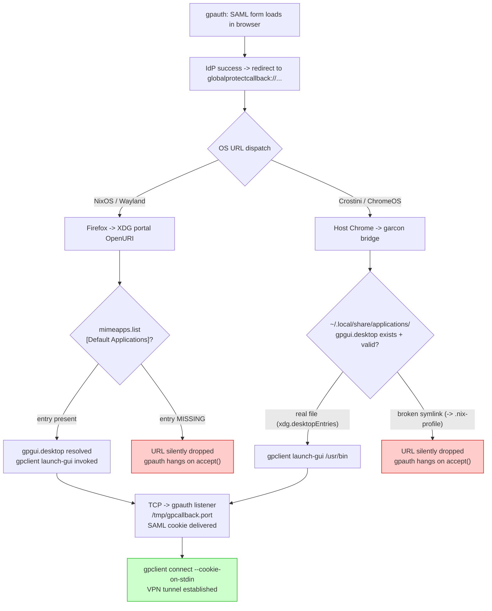

# VPN setup notes

How `vpn-connect` works on Crostini, why the SAML callback flow is fragile, and what to do if it breaks.

## The stack

1. **`gpauth`** -- Rust binary from yuezk's globalprotect-openconnect (Rust rewrite). Performs SAML auth via an external browser, captures the cookie, prints it to stdout. The `--browser` arg is **single-token** (since Aug 2024, commit `9460d49`): a named choice from `{default, firefox, chrome, chromium, remote}` OR a path to a browser executable. Multi-token strings like `"chromium --incognito"` are treated as a single filename → ENOENT. See "Known pitfalls" below.
2. **`gpclient connect`** -- can either pipe-consume a cookie from `gpauth` (`--cookie-on-stdin`) or drive SAML itself via its own `--browser` flag. The integrated mode is simpler; the pipeline mode lets you inspect/cache the cookie. Both invoke `openconnect` (linked via FFI) to bring up the GP tunnel.
3. **`vpn-slice`** -- passed as `--script` to gpclient/openconnect for split-horizon DNS. Only the named hosts route through the tunnel; everything else stays on the LAN.
4. **`vpn-connect` script** -- reconnect-loop wrapper around the above. Lives at `scripts/vpn-connect`, deployed via the Nix derivation in `contexts/linux-base.nix`.

The Nix derivation substitutes absolute store paths for `@vpn-slice@` and `@gpclient@` because the script invokes them under `sudo`, which strips PATH.

### Invocation patterns

**Integrated (simpler)**: gpclient drives SAML directly.
```bash
sudo gpclient connect access.digi.com --browser default --user "$USER" --gateway 'US East'
```

**Pipeline (cookie inspectable)**: gpauth captures cookie, gpclient consumes.
```bash
gpauth access.digi.com --browser default \
  | sudo gpclient connect access.digi.com --cookie-on-stdin --user "$USER" --gateway 'US East'
```

### Forcing fresh SAML per connect

gpclient 2.5.4 supports `--clean` ("Do not reuse the remembered authentication cookie"). This is the proper way to force re-auth each connect. Do NOT attempt to achieve this by passing browser args (e.g., `--browser "chromium --incognito"`) — see "Known pitfalls" below.

### Client identity flags (2.5.4)

- `--os {Linux,Windows,Mac}` -- declared client OS.
- `--client-version <VERSION>` -- emulate a specific GP client version, e.g., `6.3.3-650` to match a portal's expected client.
- `--user-agent <UA>` -- explicit override. If not specified, gpclient auto-generates a correct UA from `--os` + `--client-version`. Don't fabricate UAs manually unless you know the exact format the gateway expects.
- `--hip [<HIP>]` -- enable Host Integrity Protection report submission. Optional value is the path to a HIP script. Bare `--hip` semantics not documented in `--help` (test empirically).
- `--hip-user <USER>` -- the user under which the HIP script runs.

Note: `--csd-wrapper` and `--csd-user` are deprecated aliases for `--hip` and `--hip-user`.

## The SAML callback dance (the tricky part)

`gpauth` does **not** receive the SAML cookie via an HTTP redirect to a localhost server. The actual flow is more elaborate:

1. `gpauth` opens a one-shot HTTP server on a random port (e.g. 44527) at a unique URL like `/<uuid>`. It launches the browser pointing at that URL.
2. The browser hits the URL once. The HTTP server returns the SAML form HTML, then logs `stop the auth server` and shuts down.
3. `gpauth` opens a **separate raw TCP listener** on another random port (e.g. 39115). It writes that port number to **`/tmp/gpcallback.port`**.
4. The browser completes SAML against the IdP. The IdP's success page redirects to a custom URL: **`globalprotectcallback:<base64-encoded-data>`**.
5. The OS sees the `globalprotectcallback://` scheme and looks up its registered handler in the desktop database. The handler is **`gpclient launch-gui %u`**, registered via `gpgui.desktop` with `MimeType=x-scheme-handler/globalprotectcallback`.
6. `gpclient launch-gui` reads `/tmp/gpcallback.port`, opens a TCP socket to `127.0.0.1:<port>`, writes the auth data.
7. `gpauth`'s `wait_auth_data()` accepts the connection, reads the cookie, removes the port file, prints to stdout, exits.
8. Downstream `gpclient connect --cookie-on-stdin` (in our pipeline) reads the cookie and connects.

Source references: `crates/auth/src/browser/browser_auth.rs:140-170` (TCP listener side), `apps/gpclient/src/launch_gui.rs:83-101` (URL scheme handler side).

## The Crostini garcon trap

The `gpgui.desktop` URL scheme handler **must be in `~/.local/share/applications/`** for ChromeOS to find it. Garcon (the ChromeOS<->Crostini bridge) only scans the standard XDG user directory. `~/.nix-profile/share/applications/` is NOT scanned, even though `xdg-mime` inside the container correctly resolves the handler from there.

This is why `home-manager`'s `xdg.desktopEntries` alone is not sufficient on Crostini -- it installs to nix-profile but not to `~/.local/share/applications/`. We additionally use `home.file` with `mkOutOfStoreSymlink` to symlink the desktop entry into the standard location so garcon discovers it.

When this works correctly, host ChromeOS Chrome receiving a `globalprotectcallback://` URL dispatches it to the in-container `gpclient launch-gui`, which connects to the in-container `gpauth` listener over container-localhost, which is reachable from host-localhost via garcon's port forwarding.

## URL dispatch divergence by platform

The SAML callback is the most platform-sensitive part of the flow. NixOS and Crostini fail differently because the dispatch mechanism is different:



**NixOS failure mode:** `mimeapps.list` missing `x-scheme-handler/globalprotectcallback` in `[Default Applications]`. XDG portal (GTK backend, routed via `config.sway.default = ["gtk"]`) requires an explicit entry; MimeType= scanning in desktop files is insufficient when the portal uses strict mimeapps.list lookup.

**Crostini failure mode:** The garcon symlink `~/.local/share/applications/gpgui.desktop -> ~/.nix-profile/share/applications/gpgui.desktop` becomes broken when the nix gpoc package is removed from `home.packages` (gpoc moved to apt-install). `xdg.desktopEntries.gpgui` conflicts with the same `home.file` key; the broken symlink wins.

**Fix (2026-05-11):** Restored `x-scheme-handler/globalprotectcallback` to `xdg.mimeApps.defaultApplications` in `linux-base.nix`. Removed the garcon symlink from `crostini/home.nix`; `xdg.desktopEntries.gpgui` already deploys to `~/.local/share/applications/` which is garcon's discovery path.

## Diagnosing failures

**Symptom: gateway login returns HTTP 512 AFTER SAML cookie delivered (active, SC-80940)**

Pattern as of 2026-05-18:

```
[INFO  gpclient::connect] Reading cookie from standard input
[INFO  auth::browser::auth_server] Received the browser authentication data from the socket
[INFO  gpapi::portal::config] Retrieve the portal config, user_agent: PAN GlobalProtect/6.3.0-33 ...
[INFO  gpapi::portal::config] Detected portal version: Some("6.3.3-650")
[INFO  gpapi::gateway::login] Perform gateway login
[WARN  gpapi::gateway::login] GP response error: reason=<none>, status=512 <unknown status code>,
       body=<html>...Authentication failure: Invalid username or password...</html>
Error: Gateway login error: <none>
```

The SAML callback flow works correctly (cookie delivered to the in-container TCP listener). The failure is at the GATEWAY LOGIN step that follows. The error body text is PAN's verbatim string from the gateway. "Invalid username or password" is misleading in a SAML/cookie context — the literal interpretation is "gateway rejected the SAML cookie the portal just issued."

Under investigation. Hypotheses NOT yet confirmed: portal/gateway version mismatch (client UA reports `6.3.0-33`, portal is `6.3.3-650`); HIP-check enforcement; account/group-policy change; tenant-side auth pipeline change. IT ticket SC-80940 open.

**Symptom: gpauth fails immediately with `{"failure":"No such file or directory (os error 2)"}`**

gpauth's `--browser` arg was passed a multi-token string (e.g., `"chromium --incognito"`). gpauth's `--browser` is single-token; the whole string is treated as one filename and ENOENT fires before the browser ever launches. The JSON failure goes to gpauth's stdout. If piped into `gpclient --cookie-on-stdin`, gpclient parses the JSON as `SamlAuthResult::Failure(String)` (`apps/gpclient/src/connect.rs:610` uses `serde_json::from_str::<SamlAuthResult>`) and bails locally with "Failed to parse auth data" — does NOT contact the gateway.

Fix: pass `--browser` a single token (`default`, `firefox`, `chrome`, `chromium`, `remote`, or a path to a single browser executable). Use `--clean` if your goal is forcing fresh SAML, not multi-arg browser invocation.

**Symptom: gpauth hangs after "stop the auth server"**

The TCP listener is waiting on `accept()` but no `gpclient launch-gui` ever ran. Check:

1. `cat /tmp/gpcallback.port` -- should exist with a port number
2. `cat /tmp/gpcallback.log` -- does NOT exist means `launch-gui` never ran (URL scheme handler not invoked); EXISTS with errors means `launch-gui` ran but failed to connect
3. `xdg-mime query default x-scheme-handler/globalprotectcallback` -- must return `gpgui.desktop`
4. `ls -la ~/.local/share/applications/gpgui.desktop` -- must exist (this is the garcon discovery path)

**Manual cookie injection** (to test the in-container TCP path independently of the browser):

```bash
PORT=$(cat /tmp/gpcallback.port)
exec 3<>/dev/tcp/127.0.0.1/$PORT
echo -n 'globalprotectcallback:cas-as=1&un=test@example.com&token=fake' >&3
exec 3>&-
```

If gpauth advances past `accept()` and removes `/tmp/gpcallback.port`, the in-container TCP path is sound and the issue is purely browser->handler dispatch.

**Symptom: pipeline exits silently with no cookie and no error**

Probably SIGPIPE. The downstream side of `gpauth | sudo gpclient ...` (e.g., sudo prompting for a password and timing out, or gpclient hitting an early error) closes the read end of the pipe. When gpauth next writes, it gets SIGPIPE and dies. To diagnose, run `gpauth` standalone (no pipe) and capture stdout/stderr to files.

## Known related issues upstream

- yuezk/GlobalProtect-openconnect#439 -- same pattern in KASM Docker, closed WONTFIX. Containers are an unsupported topology for the external-browser callback flow.
- yuezk/GlobalProtect-openconnect#469 -- same pattern in WSL.
- yuezk/GlobalProtect-openconnect#431 -- confirms the manual TCP-injection workaround.
- yuezk/GlobalProtect-openconnect#405 -- generic "external browser callback hangs" with no resolution.

The Crostini case is technically supported (works via the garcon symlink) but it's not documented anywhere upstream. The garcon discovery path was found by experiment in this repo.

## Non-fatal warnings during connection

- `Server asked us to submit HIP report` -- the GP gateway wants a Host Information Profile. gpclient 2.5.4 supports this natively via `--hip [<script-path>]` and `--hip-user <user>` (the deprecated aliases `--csd-wrapper` and `--csd-user` still work). The connection may still complete without HIP submission but the gateway may rate-limit or disconnect later.
- `Failed to open /dev/vhost-net` -- vhost-net isn't available in Crostini's kernel. openconnect uses a userspace fallback. Performance hit but functional.

## Known pitfalls

**Do NOT use multi-token `--browser` strings.** `--browser "chromium --incognito"` (or any space-separated string) is treated by gpauth as a single filename → ENOENT. Has been broken since Aug 2024 (commit `9460d49`); no released gpauth has ever supported shell-style splitting of this arg.

If your intent is forcing fresh SAML per connect, use `gpclient connect --clean` (or the corresponding flag on whichever invocation pattern you use). Do not try to force fresh SAML via `--incognito` browser flags.

If your intent is using a specific browser configuration, write a single-token wrapper script that exec's the browser with your desired flags:

```bash
cat > ~/.local/bin/chromium-incognito <<'EOF'
#!/usr/bin/env bash
exec chromium --incognito "$@"
EOF
chmod +x ~/.local/bin/chromium-incognito
# Then: --browser chromium-incognito
```

But prefer `--browser default` + `--clean` if the incognito-for-fresh-auth was the real goal.

**Do NOT assume gpauth's `--browser` arg supports the same syntax as openconnect's `--external-browser`.** They are different binaries with different argument-parsing implementations. openconnect's `--external-browser=BROWSER` also takes a single token (verified in openconnect 9.12).

**Do NOT confuse gpauth's stdout cookie payload with a raw SAML assertion.** gpauth's stdout is a JSON-encoded `SamlAuthResult` (serde-tagged enum, `rename_all = "camelCase"`). The cookie field within carries PAN-internal token data, not raw SAML XML. Field name and exact structure: inspect a real output with `cat` before constructing `jq` filters.
