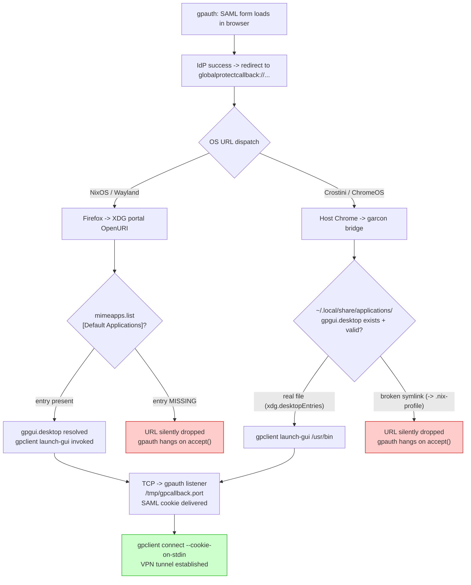

# VPN setup notes

How `vpn-connect` works on Crostini, why the SAML callback flow is fragile, and what to do if it breaks.

## The stack

1. **`gpauth`** -- Rust binary from yuezk's globalprotect-openconnect (Rust rewrite). Performs SAML auth via an external browser, captures the cookie, prints it to stdout. The `--browser` arg is **single-token** (since Aug 2024, commit `9460d49`): a named choice from `{default, firefox, chrome, chromium, remote}` OR a path to a browser executable. Multi-token strings like `"chromium --incognito"` are treated as a single filename -> ENOENT. See "Known pitfalls" below.
2. **`gpclient connect`** -- can either pipe-consume a cookie from `gpauth` (`--cookie-on-stdin`) or drive SAML itself via its own `--browser` flag. The integrated mode is simpler; the pipeline mode lets you inspect/cache the cookie. Both invoke `openconnect` (linked via FFI) to bring up the GP tunnel.
3. **`vpn-slice`** -- passed as `--script` to gpclient/openconnect for split-horizon DNS. Only the named hosts route through the tunnel; everything else stays on the LAN.
4. **`vpn-connect` script** -- reconnect-loop wrapper around the above. Lives at `scripts/vpn-connect`, deployed via the Nix derivation in `contexts/linux-base.nix`.

The Nix derivation substitutes absolute store paths for `@vpn-slice@` and `@gpclient@` because the script invokes them under `sudo`, which strips PATH.

## Dual-client architecture (gpoc + pangp + vpn-mode)

Since the 2026-05-08 CVE-2026-0257 cookie-mint hardening on PAN Prisma Access broke gpoc against the Digi portal (see "Symptom: gateway login returns HTTP 512" below), both clients live on the same machine and a toggle picks the active one. The toggle is implicit in `gpd.service`'s systemd state -- there's no separate state file.

`gpd.service` is enabled-at-boot via the pangp activation hook (see "Install" below), so the pangp daemon survives Crostini restarts and the post-reboot default is always pangp. `vpn-mode gpoc` is a session-scoped flip -- it does not survive reboot; the next boot brings gpd back up and lands the user in pangp mode again. To make gpoc the permanent default, `sudo systemctl disable gpd.service` separately.

```
vpn-mode pangp   # start gpd+gpa (PAN proprietary client owns the tun device)
vpn-mode gpoc    # stop gpd+gpa + kill any in-flight gpoc tunnel (session-scoped)
vpn-mode         # print current mode ('pangp' or 'gpoc')
```

`vpn-connect` reads `vpn-mode` and dispatches: `globalprotect connect --portal access.digi.com` for pangp, or the existing `gpauth | gpclient` retry loop for gpoc. Widgets (`panel`, `probe-lib`) detect `gpd0` (pangp) and `tun0` (gpoc) state UP independently -- no widget changes needed across the toggle.

`vpn down` is the symmetric exit path. Idempotent dual-down (#27694): runs both `tmux kill-session -t vpn` (gpoc cleanup) and `globalprotect disconnect 2>/dev/null` (pangp cleanup) unconditionally with error suppression, and reports which path(s) actually fired via stdout. Predicate-free by design — the cross-client predicate divergence (control-plane status vs kernel LOWER_UP) can disagree during teardown, so dispatching either side would mis-route; running both idempotent down sequences sidesteps the divergence. Operator-visible behavior under the toggle: the tmux VPN widget's click toggles via this command (`scripts/panel:clickModule` calls `vpnUp` to decide direction).

Packaging:
- gpoc -- apt-installed (yuezk's upstream nix derivation has a Rust build that's heavy enough to want to skip), installed by `update-env`'s gpoc group.
- pangp -- nix-managed via `~/dotfiles/pangp.nix` + `~/dotfiles/contexts/pangp.nix` home-manager module. The source tarball `PanGPLinux-<ver>.tgz` from PAN's customer portal must live at `~/crostini/` (Crostini) or the equivalent NixOS path (edit flake.nix's `pangp` let-binding).
- The home-manager activation hook keeps `/etc/systemd/system/gpd.service` in sync with the nix-store unit on every `home-manager switch` (requires sudo NOPASSWD; Crostini has it).

### Invocation patterns

**Integrated (simpler)**: gpclient drives SAML directly.
```bash
sudo gpclient connect access.digi.com --browser default --user "$USER" --gateway 'US East'
```

**Pipeline (cookie inspectable)**: gpauth captures cookie, gpclient consumes.
```bash
gpauth access.digi.com --browser default \
  | sudo gpclient connect access.digi.com --cookie-on-stdin --user "$USER" --gateway 'US East'
```

### Forcing fresh SAML per connect

gpclient 2.5.4 supports `--clean` ("Do not reuse the remembered authentication cookie"). This is the proper way to force re-auth each connect. Do NOT attempt to achieve this by passing browser args (e.g., `--browser "chromium --incognito"`) -- see "Known pitfalls" below.

### Client identity flags (2.5.4)

- `--os {Linux,Windows,Mac}` -- declared client OS.
- `--client-version <VERSION>` -- emulate a specific GP client version, e.g., `6.3.3-650` to match a portal's expected client.
- `--user-agent <UA>` -- explicit override. If not specified, gpclient auto-generates a correct UA from `--os` + `--client-version`. Don't fabricate UAs manually unless you know the exact format the gateway expects.
- `--hip [<HIP>]` -- enable Host Integrity Protection report submission. Optional value is the path to a HIP script. Bare `--hip` semantics not documented in `--help` (test empirically).
- `--hip-user <USER>` -- the user under which the HIP script runs.

Note: `--csd-wrapper` and `--csd-user` are deprecated aliases for `--hip` and `--hip-user`.

## The SAML callback dance (the tricky part)

`gpauth` does **not** receive the SAML cookie via an HTTP redirect to a localhost server. The actual flow is more elaborate:

1. `gpauth` opens a one-shot HTTP server on a random port (e.g. 44527) at a unique URL like `/<uuid>`. It launches the browser pointing at that URL.
2. The browser hits the URL once. The HTTP server returns the SAML form HTML, then logs `stop the auth server` and shuts down.
3. `gpauth` opens a **separate raw TCP listener** on another random port (e.g. 39115). It writes that port number to **`/tmp/gpcallback.port`**.
4. The browser completes SAML against the IdP. The IdP's success page redirects to a custom URL: **`globalprotectcallback:<base64-encoded-data>`**.
5. The OS sees the `globalprotectcallback://` scheme and looks up its registered handler in the desktop database. The handler is **`gpclient launch-gui %u`**, registered via `gpgui.desktop` with `MimeType=x-scheme-handler/globalprotectcallback`.
6. `gpclient launch-gui` reads `/tmp/gpcallback.port`, opens a TCP socket to `127.0.0.1:<port>`, writes the auth data.
7. `gpauth`'s `wait_auth_data()` accepts the connection, reads the cookie, removes the port file, prints to stdout, exits.
8. Downstream `gpclient connect --cookie-on-stdin` (in our pipeline) reads the cookie and connects.

Source references: `crates/auth/src/browser/browser_auth.rs:140-170` (TCP listener side), `apps/gpclient/src/launch_gui.rs:83-101` (URL scheme handler side).

## The Crostini garcon trap

The `gpgui.desktop` URL scheme handler **must be in `~/.local/share/applications/`** for ChromeOS to find it. Garcon (the ChromeOS<->Crostini bridge) only scans the standard XDG user directory. `~/.nix-profile/share/applications/` is NOT scanned, even though `xdg-mime` inside the container correctly resolves the handler from there.

This is why `home-manager`'s `xdg.desktopEntries` alone is not sufficient on Crostini -- it installs to nix-profile but not to `~/.local/share/applications/`. We additionally use `home.file` with `mkOutOfStoreSymlink` to symlink the desktop entry into the standard location so garcon discovers it.

When this works correctly, host ChromeOS Chrome receiving a `globalprotectcallback://` URL dispatches it to the in-container `gpclient launch-gui`, which connects to the in-container `gpauth` listener over container-localhost, which is reachable from host-localhost via garcon's port forwarding.

## URL dispatch divergence by platform

The SAML callback is the most platform-sensitive part of the flow. NixOS and Crostini fail differently because the dispatch mechanism is different:



**NixOS failure mode:** `mimeapps.list` missing `x-scheme-handler/globalprotectcallback` in `[Default Applications]`. XDG portal (GTK backend, routed via `config.sway.default = ["gtk"]`) requires an explicit entry; MimeType= scanning in desktop files is insufficient when the portal uses strict mimeapps.list lookup.

**Crostini failure mode:** The garcon symlink `~/.local/share/applications/gpgui.desktop -> ~/.nix-profile/share/applications/gpgui.desktop` becomes broken when the nix gpoc package is removed from `home.packages` (gpoc moved to apt-install). `xdg.desktopEntries.gpgui` conflicts with the same `home.file` key; the broken symlink wins.

**Fix (2026-05-11):** Restored `x-scheme-handler/globalprotectcallback` to `xdg.mimeApps.defaultApplications` in `linux-base.nix`. Removed the garcon symlink from `crostini/home.nix`; `xdg.desktopEntries.gpgui` already deploys to `~/.local/share/applications/` which is garcon's discovery path.

## Diagnosing failures

**Symptom: VPN widget says down despite completed SAML; SAML form had no green "via pangp" banner**

The browser opened, you completed SAML+Duo, the widget still reports down, and the tunnel never came up. Diagnostic: did the SAML form show the green ribbon "VPN auth via pangp" at the top? If NO, `vpn-connect` dispatched to gpoc instead of pangp.

Since gpoc is broken upstream by CVE-2026-0257 (gateway returns HTTP 512 for every SAML cookie), the silent dispatch to gpoc means auth completes, cookie travels to gpoc's listener, gateway-login rejects, tunnel never establishes. The `vpn` widget reports down because no `tun0`/`pangp0`/`gpd0` interface ever came up.

Common causes of unexpected gpoc dispatch:

1. **`gpd.service` inactive after Crostini sleep/restart on an install predating the `home.activation.pangpSystemUnit` enable.** Check `systemctl is-active gpd.service`. Fix: `vpn down`, `vpn-mode pangp`, `vpn up`. Then `sudo systemctl enable gpd.service` once to make it persist (or re-run `home-manager switch` so the activation hook does it declaratively).
2. **Explicit `vpn-mode gpoc` was called and not yet flipped back.** `vpn-mode` reports `gpoc`. Fix: `vpn-mode pangp`.
3. **Crostini host shut down (ChromeOS sleep/restart).** Journal shows `maitred: Received shutdown request` followed by `Stopping gpd.service`. On reboot, the enabled-at-boot symlink in `multi-user.target.wants/gpd.service` brings gpd back. If the symlink is missing (older install), see cause 1.

If the banner WAS visible but the tunnel still didn't come up, you're in pangp's gateway-login path -- check the next symptom or `sudo tail /var/lib/globalprotect/PanGPS.log`.

**Symptom: gateway login returns HTTP 512 AFTER SAML cookie delivered**

Pattern (observable since 2026-05-08):

```
[INFO  gpclient::connect] Reading cookie from standard input
[INFO  auth::browser::auth_server] Received the browser authentication data from the socket
[INFO  gpapi::portal::config] Retrieve the portal config, user_agent: PAN GlobalProtect/6.3.0-33 ...
[INFO  gpapi::portal::config] Detected portal version: Some("6.3.3-650")
[INFO  gpapi::gateway::login] Perform gateway login
[WARN  gpapi::gateway::login] GP response error: reason=<none>, status=512 <unknown status code>,
       body=<html>...Authentication failure: Invalid username or password...</html>
Error: Gateway login error: <none>
```

**Root cause** (confirmed 2026-05-19): [CVE-2026-0257](https://security.paloaltonetworks.com/CVE-2026-0257) -- PAN-OS GlobalProtect Authentication Bypass. PAN's mitigation: "the firewall regenerates cookies using improved methods." Prisma Access tenants got the coordinated pre-disclosure rollout ~5-7 days before public announcement -- matches the 2026-05-08 onset. Community tracking at [yuezk/GlobalProtect-openconnect#606](https://github.com/yuezk/GlobalProtect-openconnect/issues/606).

**Affects**: every open-source GP client (gpoc, openconnect, NetworkManager-openconnect) against PAN Prisma Access cloud gateways (`*.gpcloudservice.com`). Official pangp client succeeds in the same conditions.

**Workaround** (current): switch to pangp via `vpn-mode pangp`, then `vpn-connect`. pangp is nix-managed (see "Dual-client architecture" above). When yuezk's fix lands, `vpn-mode gpoc` flips back.

**What we tried that did NOT fix it** (so don't repeat the experiments):
- Patching gpoc to send the 3 prelogin fields pangp sends and gpoc omits (`host-id` = raw `/etc/machine-id`, `data` = base64 of `{"cas_embedded_browser":"yes"}`, `default-browser=4` instead of `1`). Field set now byte-matches pangp's, still 512.
- Forcing `.http1_only()` on reqwest's Client -- no-op because PAN cloud doesn't ALPN-advertise h2, gpoc was already h1.
- Adding `clientgpversion=6.3.0-33` at gateway-login (the commented-out branch in `gp_params.rs`).

**What we don't have yet**: gateway-login wire from pangp (mitmproxy iptables-NAT capture works for portal prelogin but stalls at gateway-login because pangp's bundled libwa* trust store rejects mitmproxy's CA partway through). Getting it requires either binary-patching `libwaapi.so` or running pangp on a Linux host without Crostini's eBPF restrictions.

**Symptom: gpauth fails immediately with `{"failure":"No such file or directory (os error 2)"}`**

gpauth's `--browser` arg was passed a multi-token string (e.g., `"chromium --incognito"`). gpauth's `--browser` is single-token; the whole string is treated as one filename and ENOENT fires before the browser ever launches. The JSON failure goes to gpauth's stdout. If piped into `gpclient --cookie-on-stdin`, gpclient parses the JSON as `SamlAuthResult::Failure(String)` (`apps/gpclient/src/connect.rs:610` uses `serde_json::from_str::<SamlAuthResult>`) and bails locally with "Failed to parse auth data" -- does NOT contact the gateway.

Fix: pass `--browser` a single token (`default`, `firefox`, `chrome`, `chromium`, `remote`, or a path to a single browser executable). Use `--clean` if your goal is forcing fresh SAML, not multi-arg browser invocation.

**Symptom: gpauth hangs after "stop the auth server"**

The TCP listener is waiting on `accept()` but no `gpclient launch-gui` ever ran. Check:

1. `cat /tmp/gpcallback.port` -- should exist with a port number
2. `cat /tmp/gpcallback.log` -- does NOT exist means `launch-gui` never ran (URL scheme handler not invoked); EXISTS with errors means `launch-gui` ran but failed to connect
3. `xdg-mime query default x-scheme-handler/globalprotectcallback` -- must return `gpgui.desktop`
4. `ls -la ~/.local/share/applications/gpgui.desktop` -- must exist (this is the garcon discovery path)

**Manual cookie injection** (to test the in-container TCP path independently of the browser):

```bash
PORT=$(cat /tmp/gpcallback.port)
exec 3<>/dev/tcp/127.0.0.1/$PORT
echo -n 'globalprotectcallback:cas-as=1&un=test@example.com&token=fake' >&3
exec 3>&-
```

If gpauth advances past `accept()` and removes `/tmp/gpcallback.port`, the in-container TCP path is sound and the issue is purely browser->handler dispatch.

**Symptom: pipeline exits silently with no cookie and no error**

Probably SIGPIPE. The downstream side of `gpauth | sudo gpclient ...` (e.g., sudo prompting for a password and timing out, or gpclient hitting an early error) closes the read end of the pipe. When gpauth next writes, it gets SIGPIPE and dies. To diagnose, run `gpauth` standalone (no pipe) and capture stdout/stderr to files.

**Symptom: PanGPS "Failed to connect to portal" with network reachable**

PanGPS.log repeatedly shows lines like `Failed to connect to <portal-host> on 443 with return value -1 and socket error 115(Operation now in progress)`. The vpn-connect helper exits with `Error: Cannot connect to GlobalProtect Portal.` From the shell the same host IS reachable: `bash -c 'exec 3<>/dev/tcp/<host>/443'` succeeds, ping has 0% loss, and iptables-legacy/iptables-nft are clean across filter/nat/mangle. `ps -o etime -p $(pgrep PanGPS)` shows multi-day uptime.

Variant -- the GUI client (PanGPA) surfaces the same underlying failure as an auth-window-shows-failed: user clicks connect, the SAML browser window opens and immediately reports the auth attempt failed before any credentials are entered. The portal pre-login under the hood is what's stuck; the GUI just renders the downstream failure as an auth failure.

Cause: PanGPS internal connection-pool/cache state degrades after long uptime across Crostini sleep/wake cycles and network swaps. Userspace `/dev/tcp` reaches the destination because each open creates a fresh socket; PanGPS's pooled/cached connection layer is the stuck one.

Diagnosis procedure:

```bash
# 1. Confirm PanGPS log shows the connect failure pattern
sudo tail -50 /opt/paloaltonetworks/globalprotect/PanGPS.log | grep -E "Failed to connect|return value -1|error 115"

# 2. Rule out network: independent TCP probe to the same host
timeout 4 bash -c 'exec 3<>/dev/tcp/access.digi.com/443' && echo OK || echo FAIL
ping -c 5 access.digi.com

# 3. Rule out firewall: both legacy and nft tables empty?
sudo iptables-legacy -L -n -v
sudo iptables-nft -L -n -v

# 4. Check daemon uptime -- if >24h on Crostini, very likely the cause
ps -o pid,etime,cmd -p $(pgrep PanGPS)
```

Fix:

```bash
sudo systemctl restart gpd
sleep 4
sudo tail -30 /opt/paloaltonetworks/globalprotect/PanGPS.log
# Expect: "Portal Pre-login starts" succeeds immediately, SAML challenge
# from IdP returns, daemon state -> "saml-pre-login" waiting for GUI client
# to drive SAML browser flow.
```

After restart, `vpn-connect` (or the widget click) makes it through SAML and `gpd0` comes UP normally.

Empirical anchors:
- 2026-05-28, penguin/Crostini, PanGPS PID 5d 19h uptime; CLI-path failure (vpn-connect exits "Cannot connect to GlobalProtect Portal"); restart resolved with no other changes.
- 2026-06-01, penguin/Crostini, PanGPS PID 2d 22h uptime; GUI-path failure (PanGPA auth window shows failed immediately on widget click); restart resolved. Shorter uptime than the first instance -- uptime is a loose predictor, not a tight one; the precipitating event is likely sleep/wake count or network swap count rather than wall time. Investigation tracked at tasks.jeeves #11009.

Mirrored to [jeeves/guides/globalprotect-vpn-guide.md](https://bitbucket.org/accelecon/jeeves/src/main/guides/globalprotect-vpn-guide.md) for team visibility; this entry is the authoritative source and stays in sync via the dotfiles cycle.

## Official PAN GlobalProtect CLI (pangp) -- current workaround for CVE-2026-0257

Until yuezk lands the fix for the gpoc 512 (see "Symptom: gateway login returns HTTP 512" above), pangp is the working VPN client. It's nix-managed via `~/dotfiles/pangp.nix` + `~/dotfiles/contexts/pangp.nix` and toggled in/out via `vpn-mode`.

### Install (Crostini, nix-managed)

Prerequisite: the PAN tarball must be present at `~/crostini/PanGPLinux-6.3.3-c31.tgz` (downloaded once from PAN's customer support portal; `update-env`'s `verifyPangpTarballTask` fails loud if missing).

```bash
update-env -1     # runs the pangp group: verify tarball, remove apt deb, then home-manager deploys nix-store pangp
```

Stages of the deploy:
1. `aptRemoveGlobalprotectTask` -- uninstalls the deprecated apt-shipped globalprotect deb if it's present (idempotent).
2. `homeManagerFlakeSwitchTask` runs `nix run ~/dotfiles#home-manager -- switch --flake ~/dotfiles#crostini`. No `--impure` flag: `pangp.nix`'s `src` is resolved by content hash via `pkgs.requireFile`, so nix-store searches by content address and pure-eval succeeds. First-time bootstrap requires `nix-store --add-fixed sha256 PanGPLinux-<ver>.tgz` once per machine (the proprietary tarball cannot be redistributed).
3. Activation hook `home.activation.pangpSystemUnit` copies `${pangp}/lib/systemd/system/gpd.service` to `/etc/systemd/system/gpd.service`, runs `daemon-reload`, `systemctl enable`s it (so the daemon survives Crostini sleep/wake and restarts), then restarts the service. Without the enable, every Crostini host-shutdown event (`maitred: Received shutdown request`) drops the user into implicit-gpoc-mode on next boot, which silently fails auth since gpoc is broken upstream. Uses `/usr/bin/sudo` (absolute path) because home-manager's activation env has minimal PATH.

Result: `gpd.service` runs PanGPS from the nix store, `WorkingDirectory=/var/lib/globalprotect` (writable, systemd-`StateDirectory`-managed), `ExecStartPre` symlinks read-only config files into the StateDirectory. PanGPA runs as a home-manager user-service, with `HOME` wrapped to `$HOME/.local/share/globalprotect` so it doesn't pollute the top-level home dir with `GP_HTML/` and `.GlobalProtect/`.

### Critical: PanGPS App Integrity check + collocation workaround (pristine binaries in /opt)

Two distinct rejection paths gate PanGPA -> PanGPS IPC. Only the first
is characterised; the second is open at `tasks.dotfiles #26911`.

**Gate 1 (verified): directory collocation.** At every IPC connection,
PanGPS reads `realpath(/proc/<peer-pid>/exe)` and
`realpath(/proc/self/exe)` and compares `dirname` of each. Mismatch
produces:

```
Error( 312): Connected by process not from GP folder, app: <peer-path>
Error( 212): Close socket.
```

The check makes no reference to the binaries' bytes or signatures.
Empirically verified 2026-05-20 on Crostini (era memory
`c9dfa3f9e2af`): byte-flipping a data byte of the PanGPS binary in
place at `/opt/...` (different SHA-384 from pristine) paired with a
pristine PanGPA at `/opt/...` is still accepted; relocating a pristine
PanGPS to a different directory while PanGPA stays at `/opt/...`
fires Error 312.

**Gate 2 (uncharacterised): autoPatchelf'd binaries.** Even when
collocated at `/opt/...`, autoPatchelf-built binaries get rejected
with a different log path:

```
Error(1322): App Integrity: Failed to verify PanGPA Signature
CPanSocketOwnerFinder::IsConnectedByPanGPA: status = 0
Error( 212): Connected by non-PanGPA. Close socket.
```

The mechanism behind Error 1322 has NOT been isolated.
`autoPatchelfHook` rewrites the ELF `.interp` section and the
binary's `RPATH`/`RUNPATH` in addition to whatever other bytes it
touches, so the gate could be (a) a real signature/hash check that a
single data-byte flip didn't reproduce, (b) an `.interp` value check,
(c) an `RPATH` origin check, or (d) something else. The targeted
isolation experiment (apply `patchelf --set-interpreter` only against
collocated binaries, then `--set-rpath` only) is tracked at
`tasks.dotfiles #26911`.

**Misframing to avoid (corrected 2026-06-03).** A prior cycle
(2026-05-27) ran `openssl dgst -sha384 -verify` against pristine vs
autoPatchelf'd PanGPA, observed `Verified OK` vs `bad signature`, and
concluded "PanGPS performs an asymmetric SHA-384 integrity check on
PanGPA." That conclusion was load-bearing but unsupported: the
openssl-dgst result only proves the on-disk `.sig` file matches the
binary, not that PanGPS uses that signature file at runtime. The
associated "9+ hour run with autoPatchelf'd PanGPS not self-rejecting"
aside was not independently verifiable. The verified gate is
collocation only; the Error-1322 mechanism remains open at #26911.

**Fix**: deploy **pristine** `.deb` bytes for both PanGPS and PanGPA
into `/opt/paloaltonetworks/globalprotect/`. This satisfies Gate 1
(collocation) by construction AND sidesteps whatever Gate 2 actually
checks. On NixOS, use `programs.nix-ld.enable = true` to provide a
real `/lib64/ld-linux-x86-64.so.2` for the pristine binaries to load.
On Crostini, the native Debian FHS already supplies that loader, so
no nix-ld needed.

```bash
# Extract the unpatched .deb subtree
TMPDIR=$(mktemp -d)
tar xzf ~/crostini/PanGPLinux-6.3.3-c31.tgz -C "$TMPDIR"
sudo mkdir -p /opt/paloaltonetworks/globalprotect
dpkg-deb -x "$TMPDIR/GlobalProtect_deb-6.3.3.1-638.deb" "$TMPDIR/extracted"
sudo cp -a "$TMPDIR/extracted/opt/paloaltonetworks/globalprotect/." /opt/paloaltonetworks/globalprotect/

# System unit override -- point ExecStart at /opt PanGPS
sudo mkdir -p /etc/systemd/system/gpd.service.d
sudo tee /etc/systemd/system/gpd.service.d/override.conf <<'EOF'
[Service]
ExecStartPre=
ExecStart=
ExecStart=/opt/paloaltonetworks/globalprotect/PanGPS
WorkingDirectory=/var/lib/globalprotect
EOF

# User unit override -- point ExecStart at /opt PanGPA, replicate HOME wrap inline.
# XDG_{CONFIG,DATA}_HOME pin to the real $HOME so xdg-open (spawned by PanGPA
# for SAML browser launch) finds mimeapps.list and .desktop files in their
# canonical user locations even though HOME is wrapped to a subdirectory.
mkdir -p ~/.config/systemd/user/gpa.service.d
cat > ~/.config/systemd/user/gpa.service.d/override.conf <<'EOF'
[Service]
ExecStart=
Environment=HOME=%h/.local/share/globalprotect
Environment=XDG_CONFIG_HOME=%h/.config
Environment=XDG_DATA_HOME=%h/.local/share
ExecStartPre=/bin/mkdir -p %h/.local/share/globalprotect
ExecStart=/opt/paloaltonetworks/globalprotect/PanGPA start
WorkingDirectory=/opt/paloaltonetworks/globalprotect
EOF

sudo systemctl daemon-reload
sudo systemctl restart gpd.service
systemctl --user daemon-reload
systemctl --user restart gpa.service
```

Verify success in the active log (when PanGPS runs from `/opt`, its log lives at `/opt/paloaltonetworks/globalprotect/PanGPS.log`, not `/var/lib/globalprotect/PanGPS.log` which is the nix-store symlink -- same content as the in-store log only when PanGPS runs from the nix store):

```bash
sudo tail /opt/paloaltonetworks/globalprotect/PanGPS.log
# look for: Info ( 71): PanGPA is managed by systemd.
# look for: Info ( 102): Start ServerThread
# absence of: Error( 212): Connected by non-PanGPA
```

This is a manual fix today; folding it into the home-manager activation hook is tracked separately. The Nix-managed systemd unit + scripts stay as they are; only the proprietary binaries themselves come from the `.deb` extract.

#### NixOS adaptation (calumny pattern)

The `.deb`-extract strategy works on Debian-flavored hosts (Crostini)
where `/lib64/ld-linux-x86-64.so.2` resolves to a real Debian glibc
loader. On bare NixOS, that path resolves to NixOS's stub-ld which
deliberately fails for generic-Linux ELF binaries (status 127, "Could
not start dynamically linked executable" per
<https://nix.dev/permalink/stub-ld>).

**Solution**: enable `programs.nix-ld.enable = true` in the NixOS
system configuration (`nixos-config/common/configuration.nix`). nix-ld
installs a real `/lib64/ld-linux-x86-64.so.2` that delegates to
nix-store glibc and reads `$NIX_LD_LIBRARY_PATH` for additional libs.
Pristine .deb binaries can then exec on NixOS without modification,
keeping them deployable at `/opt/...` collocated with each other.

This replaces an earlier autoPatchelf-based approach: that approach
rewrote PanGPA's ELF interpreter to point at a nix-store glibc, which
fixed the loader problem but tripped Gate 2 above (`Error(1322): App
Integrity: Failed to verify PanGPA Signature`). The exact mechanism
behind that rejection has not been isolated -- see "Critical: PanGPS
App Integrity check" above for the open characterisation work at
`tasks.dotfiles #26911`.

Marker-driven /opt staging is unchanged (`contexts/pangp.nix` deploys
`home.file.".local/share/pangp/{source,dest}"`; `update-env`'s
`extractGlobalprotectDebToOptTask` reads them and `cp -a` from
nix-store to runtime base). The only change is that `pangp.nix` no
longer applies `autoPatchelfHook`, so the bytes it produces (and that
`update-env` copies to /opt) are now pristine .deb bytes that PanGPS
will accept.

**Platform caveat (NixOS deploy)**: `update-env`'s
`platformTaskGroups` does NOT include the `pangp` group when
`Platform=nixos`. On NixOS hosts (calumny), `update-env -2` will not
run `extractGlobalprotectDebToOptTask` automatically; the /opt
re-staging must be invoked manually after each `mk update-dotfiles`:

```bash
systemctl --user stop gpa.service
sudo systemctl stop gpd.service
sudo cp -a "$(< ~/.local/share/pangp/source)/." "$(< ~/.local/share/pangp/dest)/"
sudo systemctl start gpd.service
systemctl --user start gpa.service
```

(`Text file busy` if services aren't stopped first -- PanGPS/PanGPA
mmap their executable images.) Wiring NixOS into the `pangp` group
declaratively is tracked at tasks.dotfiles #6547.

Verification on a NixOS host post-deploy:

```bash
file /lib64/ld-linux-x86-64.so.2
# expect: real glibc loader (not stub-ld)

sha384sum /opt/paloaltonetworks/globalprotect/PanGPA
# expect: 5bbe7d19e937af306369cced4b91e56a4ba3b12570c2f38f2fc47e88e249945a33221b22c3bc2279cf069f65e0c193ed
# (smoke check that the deployed bytes are the pristine .deb-shipped bytes;
# the hash itself is not a gate PanGPS checks at runtime -- see "Critical:
# PanGPS App Integrity check" above.)

sudo systemctl restart gpd.service
systemctl --user restart gpa.service
sudo tail /opt/paloaltonetworks/globalprotect/PanGPS.log
# expect:
#   Info ( 71): PanGPA is managed by systemd.
#   Info ( 102): Start ServerThread
# absence of Error(312) and Error(1322) means both gates pass.
```

##### NixOS deployment gaps (operational debt enumeration, 2026-05-27)

`programs.nix-ld` solves the loader problem, but pangp's runtime stack
expects further FHS-shaped infrastructure that NixOS doesn't ship by
default. Each item below was discovered empirically during the pangp
integrity-check remediation session (cycle #6456) and is being tracked
under tasks.dotfiles #6547 for declarative resolution.

**Gap 1: `update-env`'s pangp group not enabled on NixOS.**
`platformTaskGroups` includes `pangp` only for `crostini|desktop`. On
NixOS hosts (`Platform=nixos`), `update-env -2` skips:
`verifyPangpTarballTask`, `aptRemoveGlobalprotectTask`,
`extractGlobalprotectDebToOptTask`, `installPangpSystemDesktopTask`,
`enablePangpDefaultBrowserTask`. Each task either needs to run manually
or be NixOS-aware. Manual workarounds:

```bash
# /opt staging:
systemctl --user stop gpa.service
sudo systemctl stop gpd.service
sudo cp -a "$(< ~/.local/share/pangp/source)/." "$(< ~/.local/share/pangp/dest)/"
sudo systemctl start gpd.service
systemctl --user start gpa.service

# default-browser flag (PanGPA otherwise rejects SAML with "Default browser is not enabled"):
sudo ~/dotfiles/scripts/pangp-enable-default-browser
sudo systemctl restart gpd.service
systemctl --user restart gpa.service
```

**Gap 2: `gpa.service` systemd-user env is stripped on NixOS.**
PanGPA spawns `xdg-open '<saml.html>' >/dev/null 2>&1 &` to launch the
SAML browser. On NixOS, the user-systemd-manager-spawned service
inherits a minimal env: `PATH=/nix/store/.../systemd-260.1/bin/` plus
`DISPLAY=:0` only. No `WAYLAND_DISPLAY`, no
`DBUS_SESSION_BUS_ADDRESS`, no `XDG_RUNTIME_DIR`, and crucially no
`xdg-open` on PATH. The shell exits successfully (because of the `&`)
but nothing actually opens. Symptom: `vpn-connect` hangs at
"Retrieving configuration..." with no browser window appearing;
`PanGPA.log` shows `tryLaunchBrowser: xdg-open command executed
successfully`, but `/proc/<PanGPA-pid>/environ` reveals the stripped
env.

Manual workaround (drop-in override):

```bash
mkdir -p ~/.config/systemd/user/gpa.service.d
cat > ~/.config/systemd/user/gpa.service.d/99-session-env.conf <<'CONF'
[Service]
Environment=PATH=/run/current-system/sw/bin:/etc/profiles/per-user/$USER/bin:/home/$USER/.nix-profile/bin
Environment=WAYLAND_DISPLAY=wayland-1
Environment=DBUS_SESSION_BUS_ADDRESS=unix:path=/run/user/1000/bus
Environment=XDG_RUNTIME_DIR=/run/user/1000
CONF
systemctl --user daemon-reload
systemctl --user restart gpa.service
```

Declarative fix: add equivalent `Environment=` lines to
`contexts/pangp.nix`'s `systemd.user.services.gpa.Service.Environment`.

**Gap 3: PanGPS binary hardcodes FHS system-utility paths.**
`strings /opt/paloaltonetworks/globalprotect/PanGPS` reveals direct
absolute-path invocations: `/sbin/ip route get`, `/sbin/ip route add`,
`/sbin/ip route delete`, `/sbin/route add`, `/sbin/route del`,
`/sbin/ifconfig`, `/usr/bin/openssl`, `/usr/bin/grep`, `/bin/ps`,
`/usr/sbin/dmidecode`. PanGPS forks these to configure the tunnel
(routing, interface setup) and to gather host info. On NixOS none of
these paths exist by default. Symptom: portal SAML auth succeeds, but
tunnel-up fails with `Error(725): failed to generate remote host
<gateway-ip> access route` and `Error(2109): Failed to find route for
<gateway-ip>`; `gpd0` interface stays DOWN.

Manual workaround (system-level symlinks; pollutes /sbin, /usr/bin,
/usr/sbin):

```bash
sudo bash <<'CONF'
mkdir -p /sbin /usr/sbin /usr/bin /bin
ln -sf /run/current-system/sw/bin/ip          /sbin/ip
ln -sf /run/current-system/sw/bin/dmidecode   /usr/sbin/dmidecode
ln -sf /run/current-system/sw/bin/grep        /usr/bin/grep
# openssl: use the active nix-store path (verify with `readlink -f $(command -v openssl)`)
ln -sf $(command -v openssl)                  /usr/bin/openssl
ln -sf $(command -v ps)                       /bin/ps
CONF
```

`/sbin/route` and `/sbin/ifconfig` are net-tools binaries; NixOS doesn't
ship them by default. Adding them to `environment.systemPackages` (the
`net-tools` package) creates them at `/run/current-system/sw/bin/`, but
PanGPS's hardcoded `/sbin/route` would still need symlinking. PanGPS
appears to prefer `/sbin/ip route` over `/sbin/route` when both are
unavailable.

Declarative fix: use `BindReadOnlyPaths=` in `gpd.service` (via
pangp.nix) to mount the actual nix-store binaries into the expected
FHS paths within the service's mount namespace. Service-scoped,
doesn't pollute system /sbin. Approximate shape:

```nix
# gpd.service Service section:
BindReadOnlyPaths = [
  "${pkgs.iproute2}/bin/ip:/sbin/ip"
  "${pkgs.openssl}/bin/openssl:/usr/bin/openssl"
  "${pkgs.gnugrep}/bin/grep:/usr/bin/grep"
  "${pkgs.procps}/bin/ps:/bin/ps"
  "${pkgs.dmidecode}/bin/dmidecode:/usr/sbin/dmidecode"
];
```

**Gap 4: `vpn-mode`'s `swapCallbackHandler` is Crostini-specific.**
Hardcodes `$HOME/.nix-profile/share/applications/gp.desktop` (NixOS
puts it at `/etc/profiles/per-user/$USER/share/applications/`) AND
manipulates `/usr/share/applications/` (read-only nix-store on NixOS).
The whole swap concept addresses a ChromeOS-host-vs-container
scheme-handler issue that doesn't exist on NixOS. Symptom:
`vpn-mode pangp` exits 1 with "gp.desktop missing (run update-env
first)". Workaround: skip `vpn-mode pangp` and call `vpn-connect`
directly. Declarative fix: `swapCallbackHandler` should be a no-op
when `/etc/NIXOS` exists.

**Gap 5 (PARTIALLY RESOLVED 2026-06-01): Internal DNS resolution not pushed on NixOS.**
gpoc's vpn-slice writes `/etc/hosts` entries for internal hostnames at connect time
(split-horizon DNS). pangp's full-tunnel path doesn't use vpn-slice -- internal DNS
is normally pushed via NetworkManager dispatcher hooks bundled with the .deb. NixOS
doesn't run these hooks by default.

**Partial fix (deployed):** `networking.networkmanager.dns = "dnsmasq"` +
`NetworkManager/dnsmasq.d/digi-corp.conf` in `nixos-config/common/configuration.nix`
forwards `digi.com` and `idigi.com` queries to the corp DNS at `172.26.101.1`
(the VPN gateway). A more-specific `server=/access.digi.com/1.1.1.1` override
prevents the VPN portal from being captured by the `digi.com` forwarder, keeping
bootstrap working when the tunnel is down (dnsmasq longest-suffix-match). Default
upstreams `1.1.1.1`/`1.0.0.1` are explicit because NM's D-Bus upstream push doesn't
reach the dnsmasq process. After `nixos-rebuild test/switch`, restart NetworkManager
to respawn dnsmasq: `sudo systemctl restart NetworkManager`.

**Remaining gap:** The architecturally-correct fix (patch pangp to push DNS via NM
D-Bus when `gpd0` comes up, matching the behaviour bundled in the .deb's NM dispatcher
hooks) is still deferred. Any internal hostnames NOT under `digi.com` or `idigi.com`
still require manual `/etc/hosts` entries. `devdevicecloud.com` resolves identically
from public DNS and corp DNS (same AWS IPs); no forwarder needed.

**OPENSSL SYMLINK TRAP (Gap 3 follow-up)**: when implementing the
Gap-3 fix via `BindReadOnlyPaths=` in `gpd.service`, do NOT bind
`/usr/bin/openssl` to NixOS's nix-store openssl. PanGPS calls
`openssl version -d` to determine OPENSSLDIR; nix-store openssl's
OPENSSLDIR is `/nix/store/<hash>-openssl-<ver>/etc/ssl`, which does
NOT contain `tca.cer` (the trusted CA cert PanGPS expects). With
the symlink in place, portal prelogin fails with `SSL cert
verification failed with result 19 / The portal certificate is not
signed by a trusted certificate authority`. Without the symlink,
PanGPS falls back to `/etc/ssl/certs/tca.cer` (system-provided)
which works. Two approaches in the declarative fix: (a) omit
openssl from the BindReadOnlyPaths set entirely (rely on fallback),
or (b) provide a wrapper that fakes `OPENSSLDIR=/etc/ssl`. Verified
empirically 2026-05-27 (closed the prior "Open layer" diagnosis at
the same time).

Crostini: no change. Pristine bytes in `$out` are picked up by the
extract task; Crostini's native loader runs them.

### Critical: SAML browser routing on Crostini (host Chrome via darkhttpd shim)

pangp's `CPanDefaultBrowserLinux` writes the SAML form as a local `saml.html` file to `~/.local/share/globalprotect/GP_HTML/` (HTTP-POST binding -- the SAMLRequest is too long for URL-query, must come back as a form field). It then calls `xdg-open` on the file path. Two problems on Crostini:

1. **Host Chrome can't open local container files.** The `garcon_host_browser.desktop` handler is registered only for URL schemes (`http`, `https`, `ftp`, `mailto`); local file paths can't cross the Crostini boundary.
2. **xdg-open's default text/html chain falls through to the terminal vim handler** when no graphical browser is found (firefox-esr post-purge, nix firefox not on the gpa.service PATH). Cf. `garcon --client --terminal -e vim <file>` in the strace.

**Shim**: a wrapper script that converts the file path to an HTTP URL on the existing `darkhttpd` (proxy-pac-server, already serving `127.0.0.1:8120`) and hands the URL to `garcon-url-handler` -- which routes to host Chrome via the standard Crostini bridge. The shim also injects a "VPN auth via pangp" banner into `saml.html` so the operator can tell from the auth window which client dispatched (see "Dual-client banner" below).

```bash
# Wrapper at ~/.local/bin/saml-host-browser:
#!/usr/bin/env bash
exec /usr/bin/garcon-url-handler "http://127.0.0.1:8120/saml-bundle/$(basename "$1")"

# .desktop at ~/.local/share/applications/saml-host-browser.desktop:
[Desktop Entry]
Type=Application
Name=SAML host browser (via darkhttpd + garcon)
NoDisplay=true
Exec=/home/ted/.local/bin/saml-host-browser %f
MimeType=text/html;application/xhtml+xml;

# Symlink GP_HTML into the darkhttpd serve root so the URL resolves:
ln -sfn ~/.local/share/globalprotect/GP_HTML ~/.local/share/proxy-pac/saml-bundle

# Pin text/html to the shim (xdg-mime writes ~/.config/mimeapps.list):
xdg-mime default saml-host-browser.desktop text/html
xdg-mime default saml-host-browser.desktop application/xhtml+xml
```

End-to-end flow with the shim in place:

1. PanGPA writes `~/.local/share/globalprotect/GP_HTML/saml.html`
2. PanGPA invokes `xdg-open <saml.html>`
3. xdg-mime resolves `text/html` -> `saml-host-browser.desktop` (pinned)
4. `.desktop` Exec runs `saml-host-browser <saml.html>`
5. shim constructs `http://127.0.0.1:8120/saml-bundle/saml.html` and exec's `garcon-url-handler`
6. host Chrome receives the URL, fetches via darkhttpd, the form's auto-submit POSTs to the IdP
7. IdP returns a redirect to `globalprotectcallback://<base64>`
8. host Chrome dispatches the scheme back into the container (see callback-handler conflict below)
9. container's `gp.desktop` Exec calls nix-store `globalprotect defaultbrowser <url>`
10. the CLI delivers the cookie to PanGPA, which forwards to PanGPS
11. PanGPS completes gateway login; tunnel up on `gpd0`

### Dual-client banner injection

Once vpn-connect's two-client dispatch (gpoc vs pangp) exists, "did the right client run?" becomes an operator question with no in-band answer -- `vpn-mode` reports its current state but vpn-connect's dispatch path is otherwise invisible during SAML. Silent dispatch to gpoc when the operator expected pangp is the failure mode that motivated the docs around `gpd.service`-enabled-at-boot (above) and the banner here.

`saml-host-browser` injects a green banner ("VPN auth via pangp") into `saml.html` before exec'ing `garcon-url-handler`. The banner appears at the top of the SAML form in host Chrome during auth. **Absence of the banner during SAML auth = vpn-connect dispatched to gpoc instead of pangp** -- gpoc's gpauth has its own in-process auth-server that doesn't pass through this shim.

Mechanism (in the `"$samlRoot"/*)` case of `scripts/saml-host-browser`):

1. grep-check `saml.html` for the literal `document.getElementById('myform').submit();` (PanGPA's auto-submit shape). On mismatch, log a warning to stderr and proceed without modification -- proprietary HTML format changes shouldn't block auth, but should surface in logs for follow-up.
2. `sed -i` injects a `<div>` immediately after `<body>` (green ribbon banner, `position:fixed`).
3. `sed -i` wraps the auto-submit line in `setTimeout(...,1000)`. Without the delay, fast Okta re-auths (cookie still valid) navigate away from `saml.html` before the banner has rendered. The 1-second delay is the minimum that guarantees the banner is visible across the full range of IdP response latencies.

PanGPA regenerates `saml.html` from scratch every auth cycle, so in-place edits don't accumulate. The shim is the only seam: pangp's local `saml.html` is the one HTML artifact under our control between gpa.service and host Chrome, and `sed`-style injection is the simplest mechanism that doesn't require proxying every HTTP byte.

### Callback-handler conflict: system gpgui.desktop vs gp.desktop

On Crostini, ChromeOS host Chrome consults the system `/usr/share/applications/` mimeinfo cache for scheme handlers -- **not** the user-level `~/.local/share/applications/` cache. Two MimeType=`x-scheme-handler/globalprotectcallback` registrations exist by default:

- `/usr/share/applications/gpgui.desktop` -- shipped by the apt-installed `globalprotect-openconnect` package; Exec=`/usr/bin/gpclient launch-gui %u` (gpoc).
- `~/.local/share/applications/gp.desktop` -- symlinked from `~/.nix-profile/share/applications/gp.desktop` by home-manager; Exec=`/nix/store/.../bin/globalprotect defaultbrowser %u` (pangp).

ChromeOS prefers the system one and dispatches every callback to gpoc's `gpclient launch-gui`. Symptom: `/tmp/gpcallback.log` shows `gpclient::launch_gui Failed to feed auth data to the CLI: No such file or directory (os error 2)` -- gpoc has no peer running (we're in pangp mode), and the cookie never reaches PanGPS.

**Fix**: disable the system gpgui.desktop while pangp is the active mode, and install gp.desktop at the system level so ChromeOS sees it:

```bash
sudo mv /usr/share/applications/gpgui.desktop /usr/share/applications/gpgui.desktop.disabled
sudo cp ~/.nix-profile/share/applications/gp.desktop /usr/share/applications/gp.desktop
sudo update-desktop-database /usr/share/applications/
```

This is asymmetric with the `vpn-mode` toggle: gpoc-mode reverses the move. Folding the toggle into `vpn-mode` is tracked separately.

### Install (NixOS work machine)

Drop the tarball at a known path (e.g., `~/pangp/PanGPLinux-6.3.3-c31.tgz`). Declare
it as a flake input in `nixos-config/flake.nix` (not dotfiles/flake.nix -- the NixOS
flake owns the pangp derivation for NixOS hosts):

```nix
inputs.pangp-src = {
  url = "path:/home/ted/pangp/PanGPLinux-6.3.3-c31.tgz";
  flake = false;
};
```

Then in the `outputs` let-binding, pass `pangp-src` as the `src`:

```nix
pangp = import "${dotfiles}/pangp.nix" {
  pkgs = import nixpkgs { system = "x86_64-linux"; config.allowUnfree = true; };
  src = pangp-src;
};
```

Run `nix flake lock --update-input pangp-src` to hash the tarball into `flake.lock`.
Pure evaluation works without `--impure` after this. Then in `configuration.nix`:

```nix
{ pkgs, ... }: {
  systemd.packages = [ pkgs.pangp ];           # ships gpd.service
  systemd.services.gpd.wantedBy = [ "multi-user.target" ];
}
```

(`pkgs.pangp` needs an overlay -- see `~/dotfiles/contexts/pangp.nix` header for the overlay hint.) Then `nixos-rebuild switch` + `home-manager switch --flake ~/dotfiles#desktop`.

### Critical: default-browser handshake

Out of the box, pangp on Linux is configured for an **embedded browser** SAML flow. Most modern PAN portals (including Digi's) push down a "use default browser" requirement. Without client-side opt-in, the first `connect` attempt aborts with:

```
Failed to connect to access.digi.com.
Error: Default browser is not enabled
```

The handshake is two-sided:
- **Client side**: add `<default-browser>yes</default-browser>` under `<Settings>` in `pangps.xml` (`/var/lib/globalprotect/pangps.xml` for the nix-managed install, `/opt/paloaltonetworks/globalprotect/pangps.xml` for the legacy apt one), then restart the services.
- **Portal side** (your PAN admin): `Network > GlobalProtect > Portals > [config] > Agent > [config] > App > Use Default Browser for SAML Authentication = Yes`.

Strings in `/opt/paloaltonetworks/globalprotect/PanGPS` confirm the portal pushes the toggle (`Portal's saml default browser support = %s`, `Prelogin use-default-browser = %s`). The literal "Default browser is not enabled" error fires when the portal asks for it and the client hasn't opted in.

Client-side fix: `pangp-enable-default-browser` (in `~/dotfiles/scripts/`, installed by `update-env`). The script auto-detects the active pangps.xml path (`/var/lib/globalprotect/pangps.xml` for the nix-managed install, `/opt/paloaltonetworks/globalprotect/pangps.xml` for the legacy apt one), backs it up, inserts the marker, and restarts the services.

Verify: `grep default-browser /var/lib/globalprotect/pangps.xml` (or the apt path) should show the element inside `<Settings>`.

### xdg-mime ordering trap (in any test script)

If a test script writes `mkForce gp.desktop` to mimeapps.list BEFORE installing pangp (when `gp.desktop` doesn't exist on disk yet), `xdg-mime query default x-scheme-handler/globalprotectcallback` returns the next available .desktop file (e.g., `gpgui.desktop` from gpoc), not `gp.desktop`. xdg-mime falls back when the pinned default's .desktop file is missing.

Correct order: install pangp FIRST (creates `/usr/share/applications/gp.desktop`), THEN apply the mimeapps.list mkForce override, THEN verify with `xdg-mime query`.

### Connect (different CLI vocabulary than gpoc)

```bash
globalprotect connect --portal access.digi.com --username tlilley@digi.com
```

Differences from gpoc invocation:
- `--username` (pangp) vs `--user` (gpoc).
- No `--gateway` arg in the common case; pangp uses portal-driven gateway discovery. If you must pin, use the portal-config label (not a DNS hostname): the value pangp expects matches what's exposed by the portal config, often the same label gpoc uses (e.g., `"US East"`).
- Logs to `~/.GlobalProtect/`; status via `globalprotect show --status`, `globalprotect show --statistics`.

### Uninstall (full rollback)

The nix-managed install is removed by editing the home-manager config (`imports = [ ../pangp.nix ]` line in `contexts/crostini/home.nix` or `contexts/desktop/home.nix`) and re-running `home-manager switch`. That removes the package from `~/.nix-profile`. Two things home-manager does NOT clean up that you'll need to do manually:

```bash
sudo rm /etc/systemd/system/gpd.service   # the activation hook deployed it; home-manager doesn't track /etc
sudo rm -rf /var/lib/globalprotect        # systemd StateDirectory leftovers (HipPolicy.dat, logs, etc.)
rm -rf ~/.local/share/globalprotect       # user-side wrapped HOME (PanGPA.log, GP_HTML/, .GlobalProtect/)
```

To temporarily disable pangp without uninstalling -- i.e., switch back to using gpoc -- use `vpn-mode gpoc` instead.

## Diff-the-requests instrumentation (debugging "gpoc fails / pangp works")

When the OSS yuezk gpoc client returns a server-side error (e.g., HTTP 512 at gateway login) and the official pangp client succeeds against the same portal/account, the discriminator is some field-level diff in the request bodies. The two clients implement the GlobalProtect protocol independently. Capture both clients' requests and diff to identify what gpoc is omitting or misformatting.

### Pangp logging levels (what they actually capture)

`globalprotect set-log --level {debug|dump}` (must run as user, sudo errors with "Unable to run GlobalProtect CLI for system users: 0"). Empirically observed contents at dump level (the higher of the two -- LIVEcommunity reports of "passwords appearing in cleartext" are narrow to legacy Save-User-Credential mode, NOT modern SAML flows):

| Log captures at dump | Captured? |
|---|---|
| Request URL (`Request https://...`) | yes |
| User-Agent header | yes |
| Response HTTP status code | yes |
| Response content-length | yes |
| Cookie file write events (PanPUAC `.dat`, encrypted on disk) | yes |
| Tunnel packet-level metadata (IPv4 headers, send-packet-size) | yes (LOTS -- fills 10MB in ~4 min of active VPN use) |
| **HTTP POST request body** | **NO** |
| **HTTP response body** | **NO** |

Use dump for ops-level connect diagnostics (which endpoints get hit, status codes, where it fails) -- NOT for request/response field-level inspection. For that, see the webhook.site technique below.

**Log rotation hazard**: at dump level, PanGPS rotates `PanGPS.log -> PanGPS.log.old` when it hits ~10MB, and keeps only the most recent .old. With active VPN use that's every few minutes -- you'll lose the auth-cycle log to rotation before you can read it. Capture independently with `sudo tail -F /var/lib/globalprotect/PanGPS.log > /tmp/pangp-capture.log &` BEFORE the connect cycle; the tail-F follows the rotation and your file is untouched by pangp.

```bash
globalprotect set-log --level dump   # run as user, NOT sudo
sudo tail -F /var/lib/globalprotect/PanGPS.log > /tmp/pangp-capture.log 2>&1 &
TAIL=$!
globalprotect disconnect
globalprotect connect --portal access.digi.com --username tlilley@digi.com
# Wait for Connected, then:
kill "$TAIL"
sudo grep -nE 'GetHttpResponse: Request|user_agent|status is|content-length' /tmp/pangp-capture.log
# Always drop back to debug after -- dump generates massive disk and CPU pressure on a busy tunnel
globalprotect set-log --level debug
```

### Gpoc verbose logging (captures responses but NOT request bodies)

`gpclient -vvv` activates `log::trace!` macros via `clap-verbosity-flag` + `env_logger`. At the gateway-login site (`crates/gpapi/src/gateway/login.rs`):
- `info!("Perform gateway login, user_agent: ...")` -- line ~48
- `debug!("Gateway login response: {}", res)` -- line ~75 (the response only)

The request body `HashMap` built by `build_gateway_login_params` is handed to `reqwest::Client::post(...).form(&params)` without ever being printed. To see what gpoc actually SENT, you need either a custom build that adds tracing OR the pipedream technique below.

### HTTP-mirror diff technique (no TLS instrumentation)

Originally documented as "the pipedream technique" in [yuezk/GlobalProtect-openconnect#574](https://github.com/yuezk/GlobalProtect-openconnect/issues/574). As of 2026-05-19, pipedream rebranded to "String" (post-Workday acquisition) and the simple HTTP-webhook surface is gone. Equivalent free alternatives:

- **webhook.site** -- UUID-based URLs `https://webhook.site/<uuid>`; supports subdomain alias `https://<uuid>.webhook.site` (the alias form is what we need because pangp/gpoc's `--portal` accepts hostnames, not paths).
- **requestcatcher.com** -- `<random>.requestcatcher.com` subdomain native; simpler if subdomain aliasing fails.

Both serve valid Let's Encrypt certs so neither client refuses to TLS-handshake.

Procedure with webhook.site:

1. Open https://webhook.site, get a URL like `https://78b44b76-282f-4a54-bcd0-6ed7b713b531.webhook.site/`. Use the **subdomain form** for pangp/gpoc.
2. Point pangp at the mirror as if it were the portal:
   ```bash
   globalprotect disconnect 2>/dev/null
   globalprotect connect --portal <uuid>.webhook.site --username <user>
   ```
   Pangp TLS-handshakes, POSTs prelogin to `<uuid>.webhook.site/global-protect/prelogin.esp`, gets a bogus response, fails -- but webhook.site captures the request verbatim (method, URL, headers, body).
3. Same for gpoc's prelogin (standalone, doesn't need full pipeline):
   ```bash
   gpauth <uuid>.webhook.site
   ```
4. Diff the two captured POST bodies in webhook.site's UI under "Form values".

No MITM, no SSLKEYLOGFILE, no cert pinning concerns.

**Secret hygiene**: prelogin POSTs don't contain SAML cookies (those arrive later in the flow), but the captures DO include `host-id` (machine UUID) and tenant identifiers. Delete the webhook.site URL after capture; don't share the inbox link.

### Empirical request diff: pangp vs gpoc 2.5.4 prelogin (captured 2026-05-19)

POST `/global-protect/prelogin.esp` body, side-by-side:

| Field | Pangp 6.3.3-638 | Gpoc 2.5.4 | Diff |
|---|---|---|---|
| `tmp` | `tmp` | `tmp` | match |
| `clientVer` | `4100` (wire-protocol version, distinct from release version; constant since PAN-OS 5.x) | `4100` | match |
| `clientos` | `Linux` | `Linux` | match |
| `ipv6-support` | `yes` | `yes` | match |
| `cas-support` | `yes` | `yes` | match |
| `default-browser` | **`4`** | **`1`** | **gpoc declares "embedded browser only" (1) but actually does external-browser SAML; pangp declares "default browser supported" (4)** |
| `host-id` | `<32-hex machine UUID>` | *(missing)* | **gpoc omits; pangp sends `/etc/machine-id` (or `dmidecode -s system-uuid` with dashes stripped)** |
| `os-version` | `Linux <kernel-version>` | *(missing)* | **gpoc omits; sends only when `--os` flag is passed (`gp_params.rs:131-133`)** |
| `data` | b64 of `{"cas_embedded_browser":"yes"}` (CAS = Cloud Authentication Service) | *(missing)* | **gpoc omits** |
| User-Agent | `PAN GlobalProtect/6.3.3-638 (Linux <kernel>)` | `PAN GlobalProtect` | different but ruled out as load-bearing -- gpoc with UA spoofed to pangp's exact string STILL gets 512 |

### Where the diff lives in gpoc source

`crates/gpapi/src/portal/prelogin.rs:14-23,112-115`:

```rust
const REQUIRED_PARAMS: &[&str] = &[
    "host-id", "os-version", "default-browser", "cas-support", ...
];
// L112:
params.insert("default-browser", "1");   // hardcoded; no CLI override
params.insert("cas-support", "yes");
// L115:
params.retain(|k, _| REQUIRED_PARAMS.contains(k));   // silently drops anything else
```

`crates/gpapi/src/gp_params.rs:111-141`: `to_params()` never inserts `host-id` (declared as required but no code path populates), `data`, or `os-version` unless `--os` is passed.

### Ranked hypotheses for the 512

1. **(MOST LIKELY) Missing `host-id`** -- `REQUIRED_PARAMS` declares it; code never sends it; tenants with HIP-enforcement or device-posture config reject prelogin/gateway-login without it. Timing matches: 2026-05-08 outage onset aligns with potential portal-side enforcement bump.
2. **(SECOND) Missing `data` (CAS metadata)** -- Digi's portal version 6.3.3-650 is recent enough that the CAS auth path may be default; without `cas_embedded_browser` declaration, the portal may select a path that's incompatible with what gpoc's gpauth produced.
3. **(THIRD) `default-browser=1` declaring embedded but doing external SAML** -- plausible but no direct evidence the portal validates declaration-vs-execution; community workaround in #574 (`--os Windows`) doesn't change this field.
4. **Other** -- yuezk #574 (your exact symptom, open as of 2026-01-20, 46 comments, no accepted fix). Related: #318, #472 (host-id absence with PAN error 53003), #572 (Reusing Portal's cookie on the Gateway seems broken).

`clientgpversion` is ALSO commented out at `gp_params.rs:135-138` ("Do not include clientgpversion for now") and was an earlier hypothesis, but the prelogin diff above shows the bigger gap is `host-id`/`data`/`default-browser=1`. `clientgpversion` may be a contributing factor but is unlikely to be the sole cause.

### How to verify the hypothesis

Three runtime experiments, in cost order:

1. **Custom gpoc build with `host-id`** -- clone yuezk source, patch `gp_params.rs:to_params()` to read `/etc/machine-id` (which on Linux matches the pangp format exactly: 32 hex chars), insert it as `host-id` form param. Build with `cargo build --release`. ~30-60 min if cargo + deps need to be set up; minutes if Rust toolchain present.
2. **Custom build adding `data=b64({"cas_embedded_browser":"yes"})` + `os-version` + flipping `default-browser=1` -> `4`** -- if #1 alone doesn't fix it.
3. **Binary patch (single-byte `1` -> `4` for default-browser)** -- gpclient binary has `default-browser1cas-support` as a contiguous rodata literal at decimal offset 3776961; byte 3776976 is the literal `'1'` (0x31). Patch to `'4'` (0x34) with `dd conv=notrunc`. Only affects that one bound field; reversible with the inverse patch. Doesn't help with the host-id hypothesis (binary patching can't INSERT new fields, only SUBSTITUTE existing bytes). Useful only if hypothesis #3 turns out to be load-bearing on its own -- unlikely per the ranking.

### What does NOT work for TLS decryption

- **SSLKEYLOGFILE on gpoc**: gpoc uses `reqwest` with `native-tls` (OpenSSL) per workspace `Cargo.toml:34`. `native-tls` does not honor `SSLKEYLOGFILE` (see [reqwest #1016](https://github.com/seanmonstar/reqwest/issues/1016) and [#2676](https://github.com/seanmonstar/reqwest/issues/2676)). Would require a custom build swapping to `rustls` + `KeyLogFile`.
- **SSLKEYLOGFILE on pangp**: proprietary; no documented key-export. `LD_PRELOAD` of a key-extracting OpenSSL is theoretically possible but unreported for PanGPS specifically; PanGPS runs as systemd-managed root.
- **openconnect as a discriminator**: openconnect 9.12 supports `gp` protocol natively, but era memory shows openconnect already fails on Digi's tenant with the same 512 -- it inherits the upstream-incompatibility class.

### Mitmproxy approach (heavyweight fallback)

If pipedream and pangp logs are both inconclusive, mitmproxy with iptables transparent redirect works as long as PAN's portal isn't using certificate pinning beyond standard validation (no public evidence of pinning in either gpoc source or PAN docs). Install mitmproxy CA in both clients' trust stores; iptables PREROUTING redirects outbound 443 to portal IP -> mitmproxy local port. Cost: ~30 min setup. Risk: DNS interception on Crostini's veth is awkward; if cert pinning IS present, neither client will connect through the proxy.

Pipedream is strictly better when it works (which it should for clients that just do standard TLS validation).

## Known related issues upstream

- yuezk/GlobalProtect-openconnect#439 -- same pattern in KASM Docker, closed WONTFIX. Containers are an unsupported topology for the external-browser callback flow.
- yuezk/GlobalProtect-openconnect#469 -- same pattern in WSL.
- yuezk/GlobalProtect-openconnect#431 -- confirms the manual TCP-injection workaround.
- yuezk/GlobalProtect-openconnect#405 -- generic "external browser callback hangs" with no resolution.

The Crostini case is technically supported (works via the garcon symlink) but it's not documented anywhere upstream. The garcon discovery path was found by experiment in this repo.

## Non-fatal warnings during connection

- `Server asked us to submit HIP report` -- the GP gateway wants a Host Information Profile. gpclient 2.5.4 supports this natively via `--hip [<script-path>]` and `--hip-user <user>` (the deprecated aliases `--csd-wrapper` and `--csd-user` still work). The connection may still complete without HIP submission but the gateway may rate-limit or disconnect later.
- `Failed to open /dev/vhost-net` -- vhost-net isn't available in Crostini's kernel. openconnect uses a userspace fallback. Performance hit but functional.

## Known pitfalls

**Do NOT use multi-token `--browser` strings.** `--browser "chromium --incognito"` (or any space-separated string) is treated by gpauth as a single filename -> ENOENT. Has been broken since Aug 2024 (commit `9460d49`); no released gpauth has ever supported shell-style splitting of this arg.

If your intent is forcing fresh SAML per connect, use `gpclient connect --clean` (or the corresponding flag on whichever invocation pattern you use). Do not try to force fresh SAML via `--incognito` browser flags.

If your intent is using a specific browser configuration, write a single-token wrapper script that exec's the browser with your desired flags:

```bash
cat > ~/.local/bin/chromium-incognito <<'EOF'
#!/usr/bin/env bash
exec chromium --incognito "$@"
EOF
chmod +x ~/.local/bin/chromium-incognito
# Then: --browser chromium-incognito
```

But prefer `--browser default` + `--clean` if the incognito-for-fresh-auth was the real goal.

**Do NOT assume gpauth's `--browser` arg supports the same syntax as openconnect's `--external-browser`.** They are different binaries with different argument-parsing implementations. openconnect's `--external-browser=BROWSER` also takes a single token (verified in openconnect 9.12).

**Do NOT confuse gpauth's stdout cookie payload with a raw SAML assertion.** gpauth's stdout is a JSON-encoded `SamlAuthResult` (serde-tagged enum, `rename_all = "camelCase"`). The cookie field within carries PAN-internal token data, not raw SAML XML. Field name and exact structure: inspect a real output with `cat` before constructing `jq` filters.
