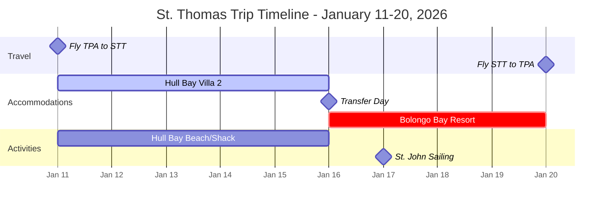

# St. Thomas Trip Planning Template - REVISED
## Living Document - Update with Verified Information Only

### Document Control
- **Created**: August 31, 2025
- **Last Updated**: August 31, 2025 (Major Revision)
- **Next Review**: When Hull Bay availability confirmed
- **Trip Year**: 2026 (not 2025)

---

## SECTION 1: TRIP PARAMETERS

### Travel Window & Flexibility
- **Duration**: 10 days, 9 nights (Sunday to Tuesday)
- **Target Dates**: January 11-20, 2026
- **Structure**: 5 nights Hull Bay + 4 nights Bolongo Bay
- **Key Requirement**: Saturday January 17 for St. John sailing from Bolongo

### Confirmed Travel Schedule

| Component | Dates | Days | Notes |
|-----------|-------|------|-------|
| **Arrival** | Sunday, Jan 11 | Day 1 | Fly TPA to STT |
| **Hull Bay Stay** | Jan 11-16 | Days 1-6 | 5 nights at Villa 2 |
| **Transfer Day** | Friday, Jan 16 | Day 6 | Check out Hull Bay, check in Bolongo |
| **Bolongo Bay Stay** | Jan 16-20 | Days 6-10 | 4 nights all-inclusive |
| **St. John Sailing** | Saturday, Jan 17 | Day 7 | Heavenly Days catamaran |
| **Departure** | Tuesday, Jan 20 | Day 10 | Fly STT to TPA |

### Budget
- **Total Budget**: $18,000
- **Committed**: $0
- **Remaining**: $18,000

### Travel Party
| Name | Age | Dietary | Mobility | Special Needs | Notes |
|------|-----|---------|----------|---------------|-------|
| Ted | Adult | No fish | Mostly | St. Thomas childhood | Decision maker |
| Colleen | Adult | Vegetarian, no fish | Full | Wants hiking time | |
| John | Adult | No fish | Mostly | Hull Bay/Frenchie connection | Needs nicotine gum for flights |
| Marlo | 11 | No fish | Full | - | Consider early flight timing |

### Non-Negotiables
- [x] 3 bedrooms (relaxed to 2BR at Bolongo only)
- [x] Air conditioning at both properties
- [x] Kitchen at Hull Bay for meal prep
- [x] Saturday availability for St. John sailing
- [x] No flights over 6 hours
- [x] No Spirit Airlines

---

## SECTION 2: ACCOMMODATIONS (VERIFIED)

### Hull Bay Hideaway - Villa 2 (First 5 Nights)
**Status**: ☑ PRICING VERIFIED | □ AVAILABILITY TBD | □ BOOKED

| Detail | Information |
|--------|-------------|
| **Property** | Villa 2 - 3BR/3BA Beachfront Villa |
| **Nightly Rate** | $1,241 |
| **Cleaning Fee** | $350 |
| **Hotel Tax** | ~$600 (estimated) |
| **Total 5 Nights** | $7,155 |
| **Check-in/out** | 3:00 PM / 11:00 AM |
| **Amenities** | Beach front, pool, kitchen, WiFi, on-site farm |
| **Food Plan** | StockedVI delivery + YesChefVI meals |
| **Local Features** | The Shack restaurant, Frenchie surf community |
| **Verified** | Aug 31, 2025 via website screenshot |

### Bolongo Bay Beach Resort (Last 4 Nights)
**Status**: ☑ PRICING VERIFIED | □ DATES TBD | □ BOOKED

| Detail | Information |
|--------|-------------|
| **Accommodation** | 2 rooms (2-queen + 1-king) |
| **Package** | All-inclusive |
| **Nightly Rate** | ~$1,465 for both rooms |
| **Total 4 Nights** | ~$5,860 |
| **Check-in/out** | 3:00 PM / 11:00 AM |
| **Included** | All meals, drinks, watersports |
| **Saturday Activity** | Heavenly Days catamaran to St. John |
| **Dietary** | Will accommodate vegetarian (contact ahead) |
| **Verified** | Aug 31, 2025 via reservation screenshot |

---

## SECTION 3: TRANSPORTATION

### Flights - READY TO RESEARCH
**Status**: ☑ DATES SET | □ PRICES TBD | □ BOOKED

#### Target Flight Dates
- **Outbound**: Sunday, January 11, 2026 (TPA → STT)
- **Return**: Tuesday, January 20, 2026 (STT → TPA)

#### Selection Criteria
- Maximum 6-hour flight duration
- No Spirit Airlines
- Prefer afternoon return for relaxed checkout
- Balance early arrival vs. reasonable departure

#### Research Needed IMMEDIATELY
- Check Google Flights, Kayak, JustFly for Jan 11-20
- Expected range: $315-400 per person
- American Airlines typically best option via MIA
- Consider PIE airport as alternative to TPA
- Tuesday return typically cheaper than Monday

### Ground Transportation
| Segment | Option | Estimated Cost | Status |
|---------|--------|----------------|---------|
| Airport to Hull Bay | Rental car or taxi | ~$100 | Not booked |
| Hull Bay days | Rental car recommended | ~$400 | Not booked |
| Hull Bay to Bolongo | Taxi | ~$50 | Not needed |
| Bolongo days | Resort shuttle/taxi | Varies | As needed |
| Bolongo to Airport | Taxi | ~$50 | Not booked |

---

## SECTION 4: FINANCIAL SUMMARY

### Verified Costs
| Category | Item | Cost | Status |
|----------|------|------|---------|
| **Accommodation** | Hull Bay Villa 2 (5 nights) | $7,155 | Est. +1 night |
| **Accommodation** | Bolongo Bay Resort (4 nights) | $5,860 | Est. +1 night |
| **Activities** | St. John Sailing (4 people) | $440 | Est. $110pp |
| **Activities** | Mafolie dinner | ~$200 | Estimate |
| **Flights** | Round-trip (4 people) | ~$1,600 | Pending (Tue return) |
| **Transportation** | Car rental + taxis | ~$700 | Estimate |
| **Food** | Grocery/meal delivery | ~$400 | Estimate |
| **Contingency** | Beach fees, shopping, misc | ~$1,000 | Buffer |

### Budget Analysis
- **Accommodations Total**: $13,015 (Hull Bay $7,155 + Bolongo $5,860)
- **Activities Total**: $640 (sailing + dinner)
- **Estimated Trip Total**: $16,955
- **Budget**: $18,000
- **Buffer Remaining**: $1,045

---

## SECTION 5: REALISTIC DAY-BY-DAY ITINERARY

### Daily Schedule Overview - 10 Day Trip
**Note:** Island traffic can add 30-45 minutes to any cross-island trip. Plan 1-2 activities per day max.

| Day | Date | Base | Morning | Afternoon/Evening | Notes |
|-----|------|------|---------|-------------------|-------|
| Sun | Jan 11 | Hull Bay | Arrive, settle in | Grocery delivery, The Shack | Recovery day |
| Mon | Jan 12 | Hull Bay | Hull Bay beach/surf | Relax at villa | Easy day |
| Tue | Jan 13 | Hull Bay | Magens Bay via trail | Lunch at top, back to Hull | North Side day |
| Wed | Jan 14 | Hull Bay | Downtown historic walk | Shopping, Parrot Fish Records | Town day |
| Thu | Jan 15 | Hull Bay | Beach morning | Drake's Seat, childhood homes | Nostalgia tour |
| Fri | Jan 16 | Transfer | Check out, Brewer's Bay | Check in Bolongo, resort time | Moving day |
| Sat | Jan 17 | Bolongo | St. John sailing all day | Evening at resort | Main event |
| Sun | Jan 18 | Bolongo | Morning Star Beach | Paradise Point sunset | East End day |
| Mon | Jan 19 | Bolongo | Resort activities | Mafolie dinner sunset | Last full day |
| Tue | Jan 20 | Depart | Resort breakfast | Airport by 2pm | Departure day |

### Must-Do vs Nice-to-Have

#### Non-Negotiable
- St. John sailing (Saturday)
- Mafolie dinner (one evening)
- Baths trip

#### Now Fits (10-day schedule)
- Downtown historic walk + shopping (Day 4)
- Paradise Point sunset (Day 8)
- Drake's Seat overlook (Day 5)
- Magens Bay with trail hike (Day 3)
- Morning Star Beach (Day 8)
- Brewer's Bay stop (Day 6)
- Childhood homes tour (Day 5)

#### Still Too Ambitious
- Virgin Gorda/Baths (needs full day + passports + $$)
- Extensive historic site tours

## SECTION 5A: ACTIVITIES & DINING REFERENCE

### Must-Do Activities & Experiences

#### Confirmed Activities
| Activity | Location | Cost | Day | Notes |
|----------|----------|------|-----|-------|
| St. John Sailing | Departs Bolongo | $440 total | Saturday Jan 17 | Heavenly Days catamaran - MUST BOOK |
| Mafolie Hotel Dinner | Mafolie | ~$200 | Evening | Sunset views, reservations needed |

#### Beach Experiences
| Beach | Area | Activities | Notes |
|-------|------|------------|-------|
| Hull Bay Beach | Hull Bay | Surfing, The Shack | Daily during Hull Bay stay |
| Magens Bay | North Side | Swimming, hiking | Via trail from top of Magen's Road drop-off |
| Morning Star Beach | Marriott | Beach day | Near Bolongo |
| Brewer's Bay | UVI area | Lunch/beach | Check road conditions |
| Lindbergh Bay | Airport area | Lunch stop | Good restaurants |

#### Nostalgic Tours
| Location | Purpose | Duration | Priority |
|----------|---------|----------|----------|
| Childhood home | Drive-by | 30 min | High (Ted & John) |
| Antilles School | Drive-by | 30 min | High (Ted) |
| Drake's Seat | Scenic overlook | 1 hour | Medium |
| Paradise Point | Sunset views | 2 hours | High - sunset timing |

#### Historic & Cultural Sites
| Site | Location | Time Needed | Notes |
|------|----------|-------------|-------|
| Blackbeard's Castle | Skytsborg Tower | 1-2 hours | Historic pirate tower, views |
| Fort Christian & Museum | Downtown | 1-2 hours | Oldest standing structure in VI |
| VI Museum of History & Culture | Havensight | 1-2 hours | Local history and culture |
| St. Thomas Synagogue | Downtown | 1 hour | Second oldest in Western Hemisphere |
| 99 Steps | Downtown | 30 min | Historic Danish street stairs |
| Market Square | Downtown | 1 hour | Local vendors, Saturday best |
| All Saints Cathedral | Downtown | 30 min | Historic Anglican church |

#### Shopping & Downtown
| Activity | Location | Best Time | Notes |
|----------|----------|-----------|-------|
| Downtown shopping | Charlotte Amalie | Morning | Avoid cruise ship days |
| Parrot Fish Records | Downtown | Afternoon | Local music, vinyl |
| Local crafts | Vendors Plaza | Anytime | Support local artisans |

### Food Planning
| Stay | Meal Plan | Details |
|------|-----------|---------|
| Hull Bay | Self-catered + restaurants | StockedVI delivery on arrival, YesChefVI dinners, The Shack |
| Bolongo | All-inclusive | Breakfast buffet, lunch, dinner, snacks all included |

---

## SECTION 6: PRE-TRIP TASKS

### Immediate Actions (This Week)
- [ ] Book Hull Bay Villa 2 for Jan 11-16, 2026 (5 nights)
- [ ] Book Bolongo Bay for Jan 16-20, 2026 (4 nights)
- [ ] Search and book flights for Jan 11-20, 2026

### After Bookings Confirmed
- [ ] Reserve St. John sailing for Saturday Jan 17
- [ ] Reserve Mafolie Hotel dinner
- [ ] Arrange StockedVI delivery for Jan 11
- [ ] Order YesChefVI meals
- [ ] Decide on rental car vs taxi for Hull Bay

### Two Weeks Before Travel
- [ ] Rental car decision
- [ ] Notify Bolongo of dietary needs
- [ ] Check passport expiration dates
- [ ] Purchase travel insurance
- [ ] John: Stock nicotine gum for flights

### Week Before Travel
- [ ] Online check-in for flights
- [ ] Print/download confirmations
- [ ] Check weather forecast
- [ ] Confirm all reservations
- [ ] Pack according to TSA guidelines

---

## SECTION 7: DECISION LOG

### Decisions Made
| Decision | Rationale | Date | Who |
|----------|-----------|------|-----|
| Split stay | Best of both worlds - villa + resort | Aug 31 | Family |
| Hull Bay first | End with relaxation at all-inclusive | Aug 31 | Ted |
| 10 days total | More relaxed pace | Aug 31 | Ted |
| No Spirit Airlines | Service/reliability concerns | Aug 31 | Ted |
| 6-hour flight limit | Comfort preference | Aug 31 | Ted |
| Budget increase to $18K | Covers 10-day trip | Aug 31 | Ted |

### Pending Decisions
| Decision | By When | Depends On |
|----------|---------|------------|
| Exact dates | Confirmed | Jan 11-20, 2026 |
| Flight times | After dates set | Price vs. convenience |
| Rental car | After booking | Cost analysis |

---

## SECTION 8: IMPORTANT NOTES

### Travel Considerations
- **TSA/Cannabis**: THCA products technically allowed if <0.3% THC with documentation
- **Medical cards**: FL medical cards not recognized in USVI
- **John's nicotine**: Gum/lozenges fine for flights
- **Cruise ships**: Avoid Havensight on heavy ship days (typically Tue-Thu)

### Key Contacts (To Be Added)
- Hull Bay Hideaway: [pending]
- Bolongo Bay: 1-800-524-4746
- StockedVI: [pending]
- YesChefVI: [pending]
- Heavenly Days Sailing: [pending]

### Documents Needed
- [ ] Passports (check expiration)
- [ ] Confirmation numbers
- [ ] Rental car confirmation
- [ ] Travel insurance policy
- [ ] TSA documentation for any medical items

---

## QUICK REFERENCE (Print for Travel)

**Trip Dates**: January 11-20, 2026
**Total Budget**: $18,000
**Hull Bay**: 5 nights @ $7,155
**Bolongo**: 4 nights @ $5,860
**Emergency**: 911
**Hospital**: Roy Schneider 340-776-8311